# Aktualisieren von Forefront Identity Manager 2010 R2 auf Microsoft Identity Manager 2016
In diesem Abschnitt ist beschrieben, wie ein vorhandenes FIM 2010 R2-Testsystem auf MIM 2016 aktualisiert wird. Für die Aktualisierung werden dieselben Installationsprogramme verwendet wie für eine neue Bereitstellung.

In diesem Abschnitt wird davon ausgegangen, dass Sie eine vorhandene FIM 2010 R2-Lösung in einer Testumgebung bereitgestellt haben. Ihr Server laufen auf Windows Server 2012, Windows Server 2012 R2 oder Windows Server 2008 R2 die geläufige Betriebssysteme für FIM 2010 R2-Server sind und alle lokalen und umgebungsbedingten Komponenten (SQL Server, Exchange Server, SharePoint Services usw.) für FIM 2010 R2 konfiguriert sind.

1.  Der MIM-Synchronisierungsdienst (Sync) wird zunächst auf einem Server installiert und gestartet, der zu der Active Directory-Domäne gehört, und ersetzt die FIM 2010 R2-Instanz von Sync.

2.  Anschließend werden MIM-Dienst und -Portal, optional einschließlich dem SSPR-Registrierungsportal und dem SSPR-Dienstportal, installiert. Die Featuregruppe für privilegierte Zugriffsverwaltung wird dabei aber nicht installiert.

3.  Die MIM-Add-Ins und -Erweiterungen samt dem integrierten SSPR-Client für Windows-Anmeldung können dann auf einem separaten Computer bereitgestellt werden.

## Vorbereitung

1.  Sichern Sie die Datenbank des FIM-Diensts, die FIM Sync-Datenbank, FIM Sync sowie die Dienstkonfiguration und die Software.

2.  Auf jedem Server, auf dem FIM 2010 R2-Komponenten – z. B. installiert sind *CORPIDM* – Melden Sie sich als Contoso\Administrator. In diesem Beispiel sind Administratorrechte erforderlich, um FIM 2010 R2 auf **MIM**zu aktualisieren.

3.  Laden Sie die MIM-Software herunter, oder entpacken Sie diese.

## Aktualisieren auf den MIM-Synchronisierungsdienst

1.  Melden Sie sich als Administrator bei einem Server an, auf dem der FIM 2010 R2-Synchronisierungsdienst (Sync) bereitgestellt wird.

2.  Sichern Sie die Datenbank, bevor Sie die nächsten Schritte ausführen.

3.  Öffnen Sie die Konsole **Dienste** , suchen Sie nach **Forefront Identity Manager-Synchronisierungsdienst**, und beenden Sie diesen.

    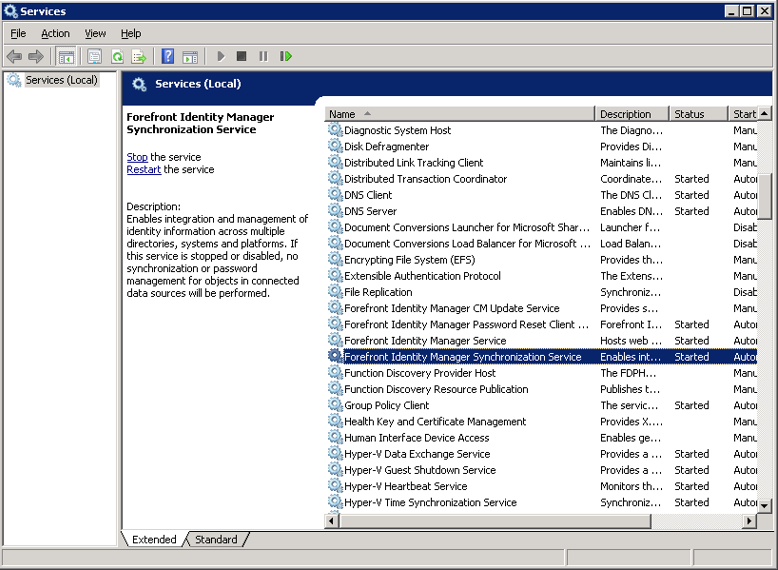

4.  Führen Sie das **MIM-Synchronisierungsdienst-Installationsprogramm**aus. Das Installationsprogramm wird die vorhandene Version von Sync erkennen und ein Upgrade vorschlagen. Klicken Sie auf die Schaltfläche **Aktualisieren** .

5.  Wenn Sie den Lizenzbedingungen zustimmen, klicken Sie auf **Weiter** .

6.  Geben Sie das Kennwort für das Dienstkonto ein, das für Sync verwendet wird, und klicken Sie auf **Weiter**.

    

7.  Vergewissern Sie sich, dass die Sicherheitsgruppennamen richtig sind, und klicken Sie auf **Weiter**.

    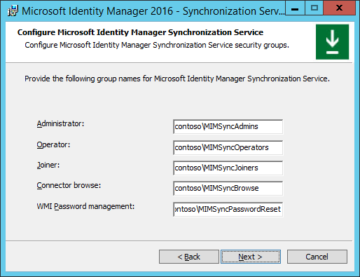

8.  Nehmen Sie keine Änderung an der Einstellung des Kontrollkästchens für Firewallregeln für eingehende RPC-Kommunikation vor.

9. Das Installationsprogramm kann FIM 2010 R2 nun auf MIM aktualisieren. Klicken Sie auf **Upgrade** , um den Upgradevorgang zu starten.

10. Der Upgradevorgang wird nun ausgeführt. Während der Ausführung des Upgradevorgangs dürfen Sie weder das Installationsprogramm beenden noch den Computer neu starten.

    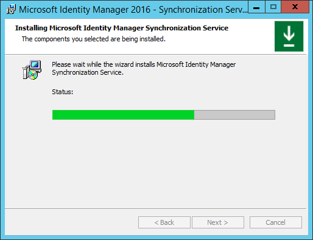

11. Im Verlauf des Upgradevorgangs wird eine Warnung hinsichtlich der Aktualisierung des Sync-Datenbank angezeigt. Es wird empfohlen, die Datenbank vor diesem Anfang zu sichern.

12. Wenn der Upgradevorgang erfolgreich abgeschlossen ist, klicken Sie auf **Fertig stellen**.

    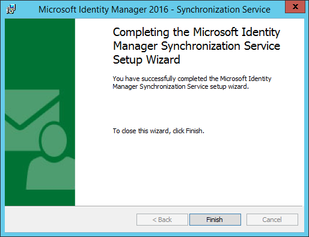

13. Beachten Sie, dass der **Synchronisierungsdienst** neu gestartet wurde.

## Aktualisieren von Dienst und Portal

1.  Melden Sie sich als Administrator bei einem Server an, auf dem der FIM 2010 R2-Dienst und das FIM 2010 R2-Portal bereitgestellt werden.

2.  Öffnen Sie die Konsole **Dienste** , suchen Sie nach **Forefront Identity Manager-Dienst**, und beenden Sie diesen.

    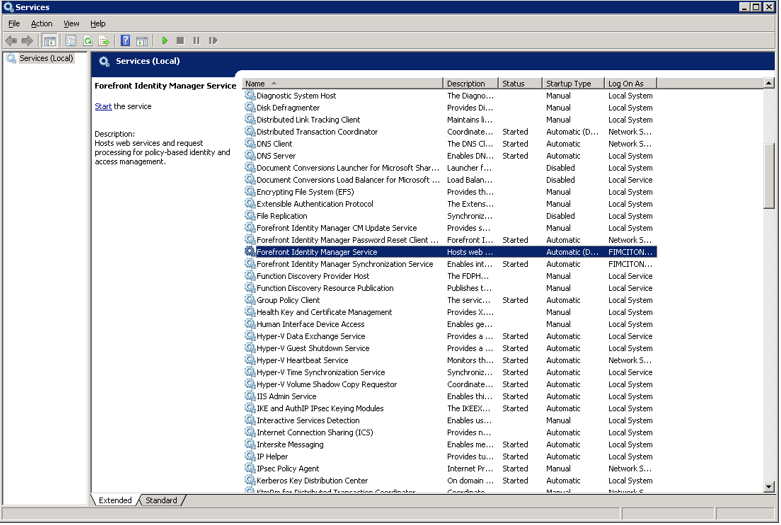

3.  Führen Sie das Installationsprogramm für den MIM-Dienst und das MIM-Portal aus. Klicken Sie auf die Schaltfläche **Weiter** .

    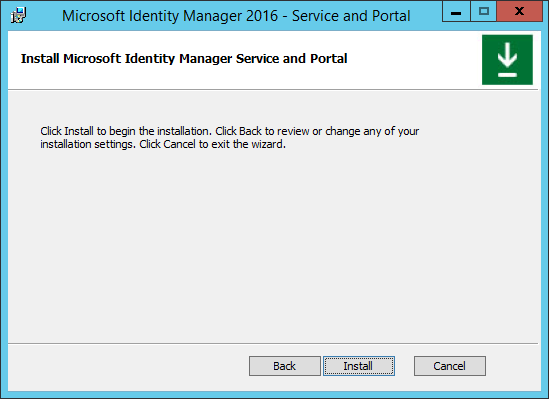

4.  Wenn Sie den Lizenzbedingungen zustimmen, klicken Sie auf **Weiter** .

5.  Klicken Sie im MIM-Bildschirm für das Programm zur Verbesserung der Benutzerfreundlichkeit auf **Weiter** , um den Vorgang fortzusetzen.

6.  Wählen Sie die MIM-Features und -Komponenten aus, die Sie installieren möchten.

    1.  **MIM-Dienst:** dieses Feature ist auf mindestens einem Server obligatorisch und erfordert eine SQL Server-Datenbank entweder zusammengestellt oder einem anderen Server.

    2.  **MIM-Portal:** Dieses Feature ist auf mindestens einem Server obligatorisch und erfordert SharePoint 2013 Foundation.

    3.  **MIM-Kennwortregistrierungsportal:** Diese Funktion ist für die Self-service-kennwortzurücksetzung erforderlich.

    4.  **MIM-Kennwortzurücksetzungsportal:** Dieses Fetaure ist für Kennwortzurücksetzung erforderlich.

        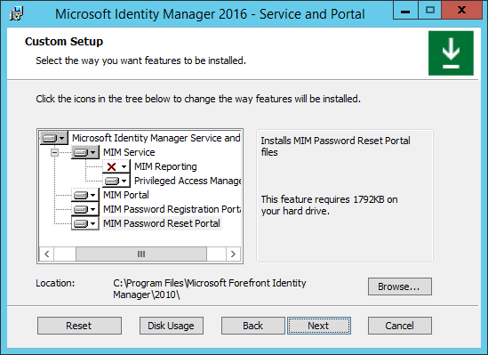

7.  Nachdem Sie alle Elemente ausgewählt haben, die Sie bereitstellen möchten, klicken Sie auf **Weiter**.

8.  Geben Sie die Details des SQL-Servers an, der für die FIM-Datenbank verwendet wird. Wählen Sie die Option aus, mit der die vorhandene Datenbank erneut verwendet wird und die Daten beibehalten werden.

9. Klicken Sie zum Fortfahren auf **Weiter** .

10. Wurde die Option zur Wiederverwendung der vorhandenen Datenbank ausgewählt, wird eine Erinnerung angezeigt, dass die Datenbank gesichert werden sollte.

11. Geben Sie die Details des E-Mail-Servers ein. Befindet sich der E-Mail-Server auf dem aktuellen Server, geben Sie „localhost“ als Adresse des Mailservers ein. Klicken Sie zum Fortfahren auf **Weiter** .

    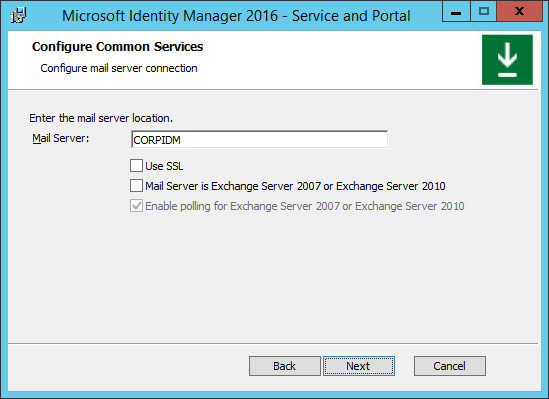

12. Wählen Sie ein Zertifikat aus, das der Dienst verwenden soll, um Clients zu überprüfen. Sie sollten das vorhandene Zertifikat aus dem lokalen Zertifikatspeicher verwenden, das zuvor vom FIM-Dienst verwendet wurde.

    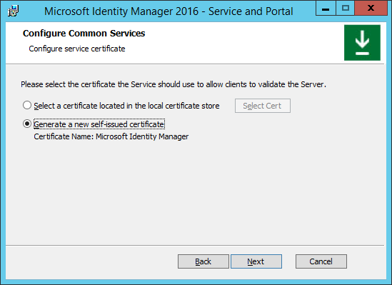

    1.  Ist die Option für vorhandene Zertifikate ausgewählt, klicken Sie auf die Schaltfläche **Zertifikat auswählen** , und wählen Sie im Popupfenster ein Zertifikat in der Liste aus. Klicken Sie auf **OK** und dann auf **Weiter**.

        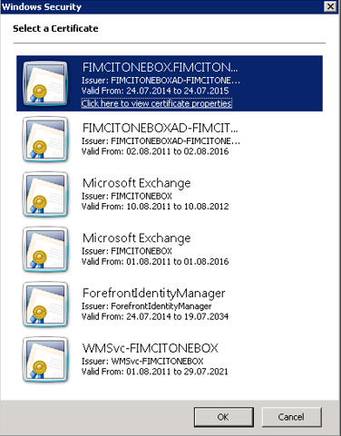

13. Konfigurieren Sie die Dienstkonto-Anmeldeinformationen für den MIM-Dienst. Beachten Sie, dass das Dienstkonto nicht mit dem Dienstkonto identisch sein darf, das für den Synchronisierungsdienst verwendet wird. Dieses Dienstkonto sollte das Konto sein, das für den FIM-Dienst verwendet wurde.

    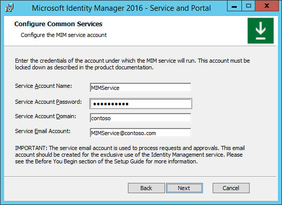

14. Konfigurieren Sie die Details des MIM-Synchronisierungsservers entsprechend der Bereitstellung des MIM-Diensts, die Sie in einem vorherigen Schritt konfiguriert haben.

    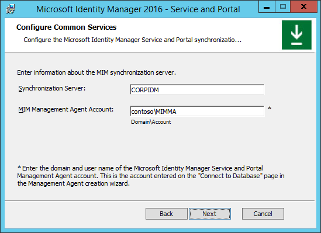

15. Wenn Sie das MIM-Portal installieren, geben Sie die Adresse des MIM-Dienst-Servers an. Klicken Sie auf **Weiter**.

16. Bei der Installation des MIM-Portals geben Sie die URL der SharePoint-Websitesammlung an, in der das FIM-Portal derzeit gehostet wird. Klicken Sie auf **Weiter**.

17. Wenn Sie das MIM-Kennwortregistrierungsportal installieren, geben Sie die angeforderte URL für das Kennwortregistrierungsportal an. Klicken Sie auf **Weiter**.

18. Konfigurieren Sie für Clients und Endbenutzer die Möglichkeit, den Dienst und das Portal zu nutzen.

    1.  Überprüfen Sie, ob **Ports 5725 und 5726 in der Firewall öffnen**aktiviert werden soll.

    2.  Überprüfen Sie, ob**Authentifizierten Benutzern Zugriff auf die MIM-Portalwebsite gewähren**aktiviert werden soll.

    3.  Klicken Sie auf **Weiter**.

19. Wenn Sie das MIM-Kennwortregistrierungsportal installieren, geben Sie die Zugriffsdetails und Anmeldeinformationen für die MIM-Kennwortregistrierung an.

    1.  Geben Sie den Dienstkontonamen (einschließlich Domäne) und das Kennwort für die MIM-Kennwortregistrierung an.

    2.  Geben Sie die Details des Hosts – Name und Port (etwa 8080) – des Kennwortregistrierungsportals an.

    3.  Aktivieren Sie die Option **Port in der Firewall öffnen** .

    4.  Klicken Sie auf **Weiter**.

        

20. Gehen Sie im nächsten Konfigurationsbildschirm der MIM-Kennwortregistrierung wie folgt vor:

    1.  Teilen Sie der MIM-Kennwortregistrierung mit, wo der MIM-Dienst installiert ist ( in der Regel auf demselben System).

    2.  Bestimmen Sie, ob Extranet- und Intranetbenutzer oder, wie dies zuvor für FIM-Kennwortzurücksetzung konfiguriert war, nur Intranetbenutzer auf dieses Portal zugreifen können.

        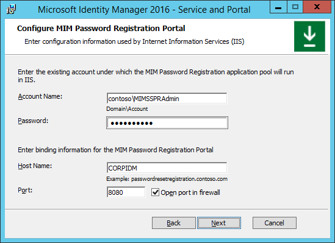

21. Wenn Sie das MIM-Kennwortzurücksetzungsportal installieren, geben Sie die Zugriffsdetails und Anmeldeinformationen für die MIM-Kennwortzurücksetzung an.

    1.  Geben Sie den Dienstkontonamen (einschließlich Domäne) und das Kennwort für die MIM-Kennwortzurücksetzung an.

    2.  Geben Sie die Details des Hosts – Name und Port (etwa 8088) – des Kennwortzurücksetzungsportals an.

    3.  Aktivieren Sie die Option **Port in der Firewall öffnen** .

    4.  Klicken Sie auf **Weiter**.

        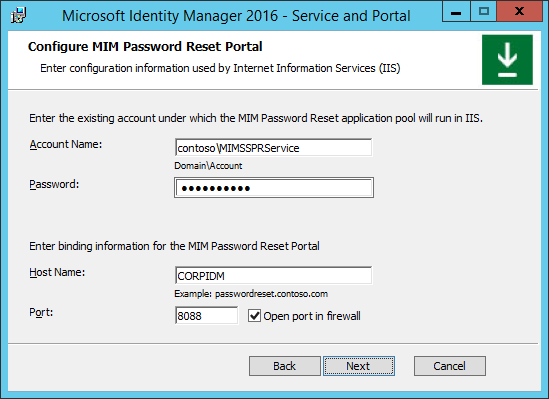

22. Gehen Sie im nächsten Konfigurationsbildschirm der MIM-Kennwortzurücksetzung wie folgt vor:

    1.  Teilen Sie der MIM-Kennwortzurücksetzung mit, wo der MIM-Dienst installiert ist.

    2.  Geben Sie an, ob Extranet- und Intranetbenutzer oder nur Intranetbenutzer auf dieses Portal zugreifen können.

23. Sobald alle Konfigurationsdefinitionen erfolgreich abgeschlossen wurden, wird der folgende Bildschirm angezeigt. Klicken Sie auf **Installieren** , damit die Installation von MIM-Dienst und -Portal begonnen wird.

24. Die Installation von MIM-Dienst und -Portal wird jetzt ausgeführt. Während der Installation dürfen Sie weder das Installationsprogramm abbrechen noch den Computer neu starten.

25. Sobald die Installation (Upgrade) von MIM-Dienst und -Portal erfolgreich abgeschlossen ist, wird der folgende Bildschirm angezeigt. Klicken Sie auf **Fertig stellen** , um die Installation abzuschließen und das Installationsprogramm zu beenden.

26. Beachten Sie, dass der **Forefront Identity Manager-Dienst** neu gestartet wurde.

Hinweis: Wenn die FIM Add-ins und Erweiterungen ist derzeit auf Computern der Benutzer für die Kennwortzurücksetzung bereitgestellt, konfigurieren Sie nicht die neuen MFA-Phone-Gates für die kennwortzurücksetzung erst, nachdem alle FIM-Add-ins und -Erweiterungen auf MIM 2016 aktualisiert wurden.  Wie die FIM 2010 und FIM 2010 R2-Add-ins und Erweiterungen der neuen Gates nicht erkannt werden, gibt sie einen Fehler, und ein Benutzer ist nicht in der Lage, zum Zurücksetzen des Kennworts abzuschließen.
<!--HONumber=Mar16_HO1-->
