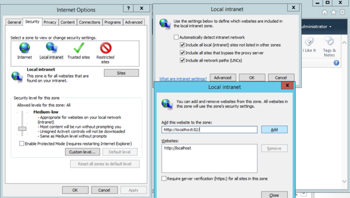

# <a name="set-up-an-identity-management-server-sharepoint"></a>Einrichten eines Identitätsverwaltungsservers: SharePoint

>[!div class="step-by-step"]
[« SQL Server 2014](prepare-server-sql2014.md)
[Exchange Server »](prepare-server-exchange.md)

> [!NOTE]
> Diese exemplarische Vorgehensweise verwendet Beispielnamen und -werte eines Unternehmens namens Contoso. Ersetzen Sie diese durch eigene Namen und Werte. Beispiel:
> - Domänencontrollername: **mimservername**
> - Domänenname: **contoso**
> - Kennwort – **Pass@word1**


## <a name="install-sharepoint-foundation-2013-with-sp1"></a>Installieren Sie **SharePoint Foundation 2013 mit SP1**

> [!NOTE]
> Das Installationsprogramm erfordert eine Internetverbindung, um die erforderlichen Komponenten herunterzuladen. Befindet sich der Computer in einem virtuellen Netzwerk, das keine Internetverbindung bietet, fügen Sie dem Computer eine weitere Netzwerkschnittstelle hinzu, die eine Verbindung mit dem Internet ermöglicht. Diese kann deaktiviert werden, nachdem die Installation abgeschlossen ist.

Führen Sie die folgenden Schritte aus, um SharePoint Foundation 2013 SP1 zu installieren. Nach Abschluss der Installation wird der Server neu gestartet.

1.  Starten Sie **PowerShell** als Domänenadministrator.

    -   Wechseln Sie in das Verzeichnis, in dem SharePoint entpackt wurde.

    -   Geben Sie folgenden Befehl ein:

        ```
        .\prerequisiteinstaller.exe
        ```

2.  Nachdem die erforderlichen Komponenten für **SharePoint** installiert sind, installieren Sie **SharePoint Foundation 2013 mit SP1** , indem Sie den folgenden Befehl eingeben:

    ```
    .\setup.exe
    ```

3.  Wählen Sie den Typ für einen vollständigen Server aus.

4.  Nachdem die Installation abgeschlossen ist, führen Sie den Assistenten aus.

## <a name="run-the-wizard-to-configure-sharepoint"></a>Führen Sie den Assistenten aus, um SharePoint zu konfigurieren

Folgen Sie den im **Konfigurations-Assistenten für SharePoint-Produkte** erläuterten Schritten, um SharePoint für die Arbeit mit MIM zu konfigurieren.

1. Wechseln Sie auf die Registerkarte **Verbindung mit einer Serverfarm herstellen** , um eine neue Serverfarm zu erstellen.

2. Geben Sie diesen Server als Datenbankserver für die Konfigurationsdatenbank und *Contoso\SharePoint* als Datenbankzugriffskonto für SharePoint an.

3. Erstellen Sie ein Kennwort für die Passphrase der Farmsicherheit.

4. Wenn der Konfigurations-Assistent die Konfigurationsaufgabe 10 von 10 abgeschlossen hat, klicken Sie auf „Fertig stellen“. Daraufhin wird ein Webbrowser geöffnet.

5. Authentifizieren Sie sich im Internet Explorer-Popup als *Contoso\Administrator* (oder mit dem entsprechenden Domänenadministratorkonto), um den Vorgang fortzusetzen.

6. Starten Sie den Assistenten (innerhalb der Webanwendung), um die SharePoint-Farm zu konfigurieren.

7. Wählen Sie die Option zum Verwenden des vorhandenen verwalteten Kontos (*Contoso\SharePoint*) aus, und klicken Sie auf **Weiter**.

8. Klicken Sie im Fenster zum **Erstellen einer Websitesammlung** auf **Überspringen**.  Klicken Sie dann auf **Fertig stellen**.

## <a name="prepare-sharepoint-to-host-the-mim-portal"></a>Vorbereiten von SharePoint zum Hosten des MIM-Portals

> [!NOTE]
> Zunächst wird SSL nicht konfiguriert. Achten Sie darauf, dass Sie SSL oder ähnliches konfigurieren, bevor Sie den Zugriff auf dieses Portal ermöglichen.

1. Starten Sie  **SharePoint 2013-Verwaltungsshell**, und führen Sie das folgende PowerShell-Skript aus, um eine **SharePoint Foundation 2013-Webanwendung** zu erstellen.

    ```
    $dbManagedAccount = Get-SPManagedAccount -Identity contoso\SharePoint
    New-SpWebApplication -Name "MIM Portal" -ApplicationPool "MIMAppPool"
    -ApplicationPoolAccount $dbManagedAccount -AuthenticationMethod "Kerberos" -Port 82 -URL http://corpidm.contoso.local
    ```

    > [!NOTE]
    > Es wird eine Warnmeldung angezeigt, in der angegeben ist, dass die klassische Windows-Authentifizierungsmethode verwendet wird, und es kann mehrere Minuten dauern, bis der letzte Befehl abgeschlossen ist. Nach Abschluss gibt die Ausgabe die URL des neuen Portals an. Belassen Sie das Fenster **SharePoint 2013-Verwaltungsshell** geöffnet, um sich später darauf zu beziehen.

2. Starten Sie „SharePoint 2013-Verwaltungsshell“, und führen Sie das folgende PowerShell-Skript aus, um eine **SharePoint-Websitesammlung** zu erstellen.

  ```
  $t = Get-SPWebTemplate -compatibilityLevel 14 -Identity "STS#1"
  $w = Get-SPWebApplication http://corpidm.contoso.local:82
  New-SPSite -Url $w.Url -Template $t -OwnerAlias contoso\Administrator
  -CompatibilityLevel 14 -Name "MIM Portal" -SecondaryOwnerAlias contoso\BackupAdmin
  $s = SpSite($w.Url)
  $s.AllowSelfServiceUpgrade = $false
  $s.CompatibilityLevel
  ```

  > [!NOTE]
  > Vergewissern Sie sich, dass die Variable *CompatibilityLevel* das Ergebnis „14“ hat. Ist das Ergebnis gleich „15“, wurde die Websitesammlung nicht für die 2010-Umgebungsversion erstellt. Löschen Sie die Websitesammlung, und erstellen Sie diese neu.

3. Deaktivieren Sie den **serverseitigen SharePoint-Ansichtszustand** und die SharePoint-Aufgabe „Integritätsanalyseauftrag (Stündlich, Microsoft SharePoint Foundation-Timer, Alle Server)“, indem Sie die folgenden PowerShell-Befehle in der **SharePoint 2013-Verwaltungsshell** ausführen:

  ```
  $contentService = [Microsoft.SharePoint.Administration.SPWebService]::ContentService;
  $contentService.ViewStateOnServer = $false;
  $contentService.Update();
  Get-SPTimerJob hourly-all-sptimerservice-health-analysis-job | disable-SPTimerJob
  ```

4. Öffnen Sie auf Ihrem Identitätsverwaltungsserver eine neue Registerkarte des Webbrowsers, navigieren Sie zu „http://localhost:82/“, und melden Sie sich als *contoso\Administrator* an.  Eine leere SharePoint-Website namens *MIM-Portal* wird angezeigt.

    

5. Kopieren Sie die URL, und öffnen Sie in Internet Explorer das Dialogfeld **Internetoptionen**. Wechseln Sie zur Registerkarte **Sicherheit**, wählen Sie **Lokales Intranet** aus, und klicken Sie auf **Websites**.

    

6. Klicken Sie im Fenster **Lokales Intranet** auf **Erweitert**, und fügen Sie die kopierte URL in das Textfeld **Diese Website zur Zone hinzufügen** ein. Klicken Sie auf **Hinzufügen**, und schließen Sie die Fenster.

7. Öffnen Sie das Programm **Verwaltungstools**, und navigieren Sie zu **Dienste**. Suchen Sie den SharePoint-Verwaltungsdienst, und starten Sie ihn, sofern dieser nicht bereits ausgeführt wird.

>[!div class="step-by-step"]  
[« SQL Server 2014](prepare-server-sql2014.md)
[Exchange Server »](prepare-server-exchange.md)


<!--HONumber=Nov16_HO2-->


