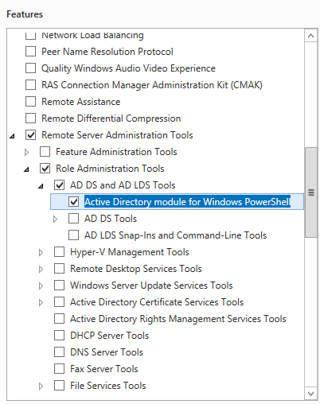

# <a name="set-up-an-identity-management-server-windows-server-2012-r2"></a>Einrichten eines Identitätsverwaltungsservers: Windows Server 2012 R2

>[!div class="step-by-step"]
[« Vorbereiten einer Domäne](preparing-domain.md)
[SQL Server 2014 »](prepare-server-sql2014.md)

> [!NOTE]
> Diese exemplarische Vorgehensweise verwendet Beispielnamen und -werte eines Unternehmens namens Contoso. Ersetzen Sie diese durch eigene Namen und Werte. Beispiel:
> - Domänencontrollername: **mimservername**
> - Domänenname: **contoso**
> - Kennwort – **Pass@word1**

## <a name="join-windows-server-2012-r2-to-your-domain"></a>Hinzufügen von Windows Server 2012 R2 zu Ihrer Domäne

Beginnen Sie mit einem Computer mit Windows Server 2012 R2 mit mindestens 8 GB RAM. Geben Sie bei der Installation die Edition „Windows Server 2012 R2 Standard (Server mit grafischer Benutzeroberfläche) x64“ an.

1. Melden Sie sich bei dem neuen Computer als Administrator an.

2. Geben Sie dem Computer mithilfe der Systemsteuerung eine statische IP-Adresse im Netzwerk. Konfigurieren Sie die Netzwerkschnittstelle so, dass DNS-Abfragen an die IP-Adresse des Domänencontrollers im vorherigen Schritt gesendet werden, und legen Sie den Computernamen auf **CORPIDM** fest.  Dies erfordert einen Neustart des Servers.

3. Öffnen Sie die Systemsteuerung, und fügen Sie den Computer der Domäne *contoso.local* hinzu, die Sie im letzten Schritt konfiguriert haben.  Dies beinhaltet die Bereitstellung des Benutzernamens und der Anmeldeinformationen eines Domänenadministrators wie *Contoso\Administrator*.  Nachdem die Willkommensnachricht angezeigt wird, schließen Sie das Dialogfeld, und starten Sie den Server erneut neu.

4. Melden Sie sich auf dem Computer *CorpIDM* als Domänenadministrator an, z.B. als *Contoso\Administrator*.

5. Starten Sie ein PowerShell-Fenster als Administrator, und geben Sie den folgenden Befehl ein, um den Computer mit den Gruppenrichtlinieneinstellungen zu aktualisieren.

    ```
    gpupdate /force /target:computer
    ```

    Nach spätestens einer Minute wird der Vorgang mit der Meldung „Die Aktualisierung der Computerrichtlinie wurde erfolgreich abgeschlossen“ beendet.

6. Fügen Sie die Rollen **Webserver (IIS)** und **Anwendungsserver**, die **.NET Framework** 3.5-, 4.0- und 4.5-Features und das **Active Directory-Modul für Windows PowerShell** hinzu.

    

7. Geben Sie in PowerShell die folgenden Befehle ein: Möglicherweise ist es notwendig, dass Sie einen anderen Speicherort für die Quelldateien für **.NET Framework** 3.5-Features angeben. Diese Funktionen sind in der Regel nicht vorhanden, wenn Windows Server installiert wird. Sie sind aber auf dem Betriebssystem-Installationsdatenträger im Ordner „Sources“ im parallelen Ordner (SxS) verfügbar, beispielsweise „D:\Sources\SxS\*“.

    ```
    import-module ServerManager
    Install-WindowsFeature Web-WebServer, Net-Framework-Features,rsat-ad-powershell,Web-Mgmt-Tools,Application-Server,Windows-Identity-Foundation,Server-Media-Foundation,Xps-Viewer –includeallsubfeature -restart -source d:\sources\SxS
    ```

## <a name="configure-the-server-security-policy"></a>Konfigurieren der Serversicherheitsrichtlinie

Richten Sie die Serversicherheitsrichtlinien ein, damit die neu erstellten Konten als Dienste ausgeführt werden können.

1. Starten Sie das Programm „Lokale Sicherheitsrichtlinie“.

2. Navigieren Sie zu **Lokale Richtlinien > Zuweisen von Benutzerrechten**.

3. Klicken Sie im Detailbereich mit der rechten Maustaste auf **Anmelden als Dienst**, und wählen Sie dann **Eigenschaften**aus.

    

4. Klicken Sie auf **Benutzer oder Gruppe hinzufügen**, und geben Sie im Textfeld `contoso\MIMSync; contoso\MIMMA; contoso\MIMService; contoso\SharePoint; contoso\SqlServer; contoso\MIMSSPR` ein. Klicken Sie dann auf **Namen überprüfen** und anschließend auf **OK**.

5. Klicken Sie auf **OK**, um das Eigenschaftenfenster **Anmelden als Dienst** zu schließen.

6.  Klicken Sie im Detailbereich mit der rechten Maustaste auf **Zugriff vom Netzwerk auf diesen Computer verweigern**, und wählen Sie **Eigenschaften** aus.

7. Klicken Sie zunächst auf **Benutzer oder Gruppe hinzufügen**, geben Sie in das Textfeld `contoso\MIMSync; contoso\MIMService` ein, und klicken Sie auf **OK**.

8. Klicken Sie auf **OK**, um das Eigenschaftenfenster **Zugriff vom Netzwerk auf diesen Computer verweigern** zu schließen.

9. Klicken Sie im Detailbereich mit der rechten Maustaste auf **Lokal anmelden verweigern**, und wählen Sie dann **Eigenschaften** aus.

10. Klicken Sie zunächst auf **Benutzer oder Gruppe hinzufügen**, geben Sie in das Textfeld `contoso\MIMSync; contoso\MIMService` ein, und klicken Sie auf **OK**.

11. Klicken Sie auf **OK**, um das Eigenschaftenfenster **Lokal anmelden verweigern** zu schließen.

12. Schließen Sie das Fenster „Lokale Sicherheitsrichtlinien“.


## <a name="change-the-iis-windows-authentication-mode"></a>Ändern Sie den IIS-Windows-Authentifizierungsmodus.

1.  Öffnen Sie ein PowerShell-Fenster.

2.  Beenden Sie IIS mit dem Befehl *iisreset/STOP*.

    ```
    iisreset /STOP
    C:\Windows\System32\inetsrv\appcmd.exe unlock config /section:windowsAuthentication -commit:apphost
    iisreset /START
    ```

>[!div class="step-by-step"]  
[« Vorbereiten einer Domäne](preparing-domain.md)
[SQL Server 2014 »](prepare-server-sql2014.md)


<!--HONumber=Nov16_HO2-->


