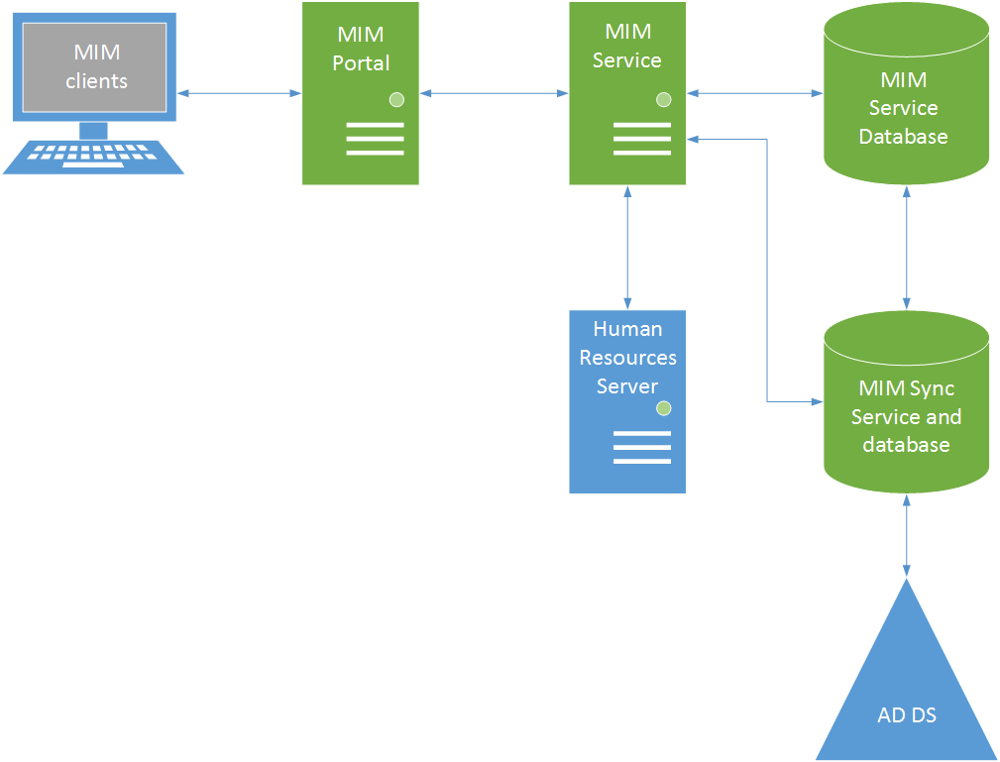

# Aspekte der Topologie
Sie können Microsoft Identity Manager (MIM) Komponenten auf demselben Server oder auf mehrere Server in verschiedenen Konfigurationen bereitstellen. Die Topologie, die Sie für die Bereitstellung auswählen, wirkt sich auf die Leistung, die Sie aus MIM erzielen können. In diesem Artikel werden mehrere Bereitstellungstopologien, die Sie implementieren berücksichtigen können.

## Komponenten
Beim Entwerfen der Bereitstellungstopologie ist es wichtig zu wissen, was bewirkt, dass jede Komponente, und wie sie alle interagieren. Sie können alle Komponenten auf demselben Computer gehostet oder diese auf mehreren Computern und Servern zu verteilen.

| Komponente | Demselben computer | Separaten server | Netzwerklastenausgleich-cluster | Server-cluster |
| --- | --- | --- | --- | --- |
| MIM-Portal | Ja | Ja | Ja | |
| MIM-Dienst | Ja | Ja | Ja | |
| MIM-Synchronisierungsdienst | Ja | Ja | | |
| Microsoft SQL Server | Ja | Ja | | Ja |

## Topologie mit mehreren Ebenen
Die Topologie mit mehreren Ebenen ist die am häufigsten verwendeten Topologie. Es bietet die größte Flexibilität. Die MIM-Portal, MIM-Dienst und -Datenbanken sind in Ebenen unterteilt und auf mehreren Computern bereitgestellt. Diese Topologie sorgt für mehr Flexibilität bei der Skalierung der verschiedenen Komponenten des MIM. Beispielsweise können Sie das MIM-Portal horizontal skalieren, durch Hinzufügen zusätzlicher Server in einem Cluster (Network Load Balancing, NLB). Auf ähnliche Weise können Sie den MIM-Dienst mithilfe eines NLB-Clusters und erhöhen die Anzahl der Computer (Knoten) im Cluster nach Bedarf skalieren.

In der Topologie mit mehreren Ebenen wird ein dedizierter Computer zum Hosten der einzelnen SQL-Datenbank (eine für den MIM-Dienst) und eine andere für den MIM-Synchronisierungsdienst zugewiesen. Die Skalierbarkeit der Leistung der Computer zugreifen, die die SQL-Datenbanken erhöht werden können, durch Hinzufügen oder Aktualisieren von Hardware, z. B. durch das Aktualisieren der CPUs, Hinzufügen von zusätzlichen CPUs, zufällige erhöhen hosten Arbeitsspeicher (RAM) oder den Arbeitsspeicher aktualisieren oder die Aktualisierung der Festplattenkonfigurationen erhöhen, die Lese- und Schreibzugriff und Verringerung der Latenz.

In dieser Konfiguration werden die MIM-Synchronisierungsdienst und seine Datenbank auf demselben Computer gehostet. Allerdings sollten Sie möglicherweise ähnlichen Leistung zu erreichen, wenn eine dediziertes 1-Gigabit-Netzwerk-Verbindung zwischen der MIM-Synchronisierungsdienst und seine Datenbank besteht, wenn sie auf verschiedenen Computern gehostet werden.

## Multi-Tier-Topologie mit mehreren MIM-Diensten.
Synchronisierung von Daten mit externen Systemen kann hinzufügen eine erhebliche Belastung für das System und über einen längeren Zeitraum ausführen. Wenn die Konfiguration der Synchronisierung Richtlinien mit Workflows auslösen führt, konkurrieren diese Richtlinien für Ressourcen mit Endbenutzer Workflows. Solche Probleme können mit authentifizierungsworkflows, z. B. das Zurücksetzen von Kennwörtern, betont werden, die in Echtzeit mit Endbenutzer warten, bis des Prozess abgeschlossen haben. Durch die Bereitstellung einer Instanz des MIM-Diensts für Endbenutzer und ein separates Portal für die Synchronisierung von Verwaltungsdaten, können Sie eine bessere Reaktionsfähigkeit für Endbenutzer Vorgänge bereitstellen.

Als können mit der standardmäßigen Multi-Tier-Topologie können Sie MIM-Portal mithilfe eines NLB-Clusters und durch Erhöhen der Anzahl von Knoten im Cluster nach Bedarf Leistungssteigerung.

Die Leistung-Computer mit SQL Server, die die MIM-Synchronisierungsdienst hosten und die MIM-Dienstdatenbank werden die allgemeine Leistung der MIM Bereitstellung erheblich beeinflussen. Daher führen Sie die Empfehlungen in SQL Server-Dokumentation zur Optimierung der Leistung der Datenbank. Finden Sie in den folgenden Dokumenten Informationen:

- [Storage 10 wichtigsten Best Practices](http://go.microsoft.com/fwlink/?LinkID=183663)

- [Optimieren der Tempdb-Leistung](http://go.microsoft.com/fwlink/?LinkID=188267)

- [Bewährte Methoden für SQL Server](http://go.microsoft.com/fwlink/?LinkID=188268)

## Weitere Informationen:
- Der herunterladbare [Forefront Identity Manager (FIM) 2010-Planungshandbuch für die Capactity](http://go.microsoft.com/fwlink/?LinkId=200180) wird ausführlicher über eine Test-Build und die Ergebnisse der Leistungstests.
<!--HONumber=Mar16_HO2-->
