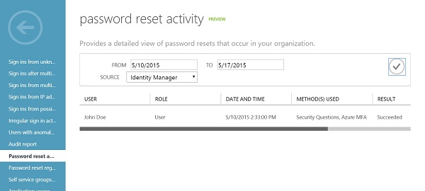
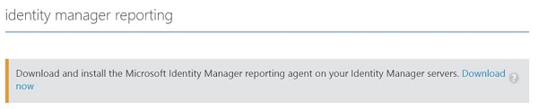
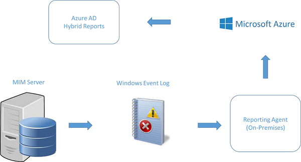

---
# required metadata

title: Identity Manager-Hybridberichterstellung in Azure | Microsoft Identity Manager
description: Mit der Azure Active Directory-Hybridberichterstellung können Sie benutzerdefinierte Berichte erstellen, die sowohl Cloud- als auch lokale Ereignisse enthalten.
keywords:
author: kgremban
manager: stevenpo
ms.date: 04/28/2016
ms.topic: article
ms.prod: identity-manager-2015
ms.service: microsoft-identity-manager
ms.technology: security
ms.assetid: 7320f014-8b60-4866-92de-cfbd3e6edc48

# optional metadata

#ROBOTS:
#audience:
#ms.devlang:
ms.reviewer: mwahl
ms.suite: ems
#ms.tgt_pltfrm:
#ms.custom:

---

# Identity Manager-Hybridberichterstellung in Azure
Wenn Sie über ein Azure-Abonnement verfügen, können Sie jetzt einfach einen Bericht von Ereignissen erstellen, die sowohl lokal als auch in der Cloud auftreten. Die Berichte können dann im Azure-Portal angezeigt werden. Die Berichte werden zudem mit den Azure Active Directory-Aktivitäten kombiniert. Mithilfe der Identity Manager-Hybridberichterstellung kann das Azure AD-Verwaltungsportal die Aktivitätsberichte zur Identitätsverwaltung für lokale Aktivitäten sowie für Aktivitäten in der Cloud anzeigen. Diese Berichterstellungsfunktion bietet Folgendes:

-   Ihr Benutzererlebnis wird vereinheitlicht: Vereinheitlichte Berichte für IAM-Aktivitäten (lokal und für die Cloud).

-   Die Notwendigkeit einer lokalen Data Warehouse-Infrastruktur für die Berichterstellung wird beseitigt.

-   Ihre Daten gehören Ihnen: Die Berichtsdaten können problemlos aus dem lokalen Identity Manager oder aus Azure AD exportiert und dazu verwendet werden, um Berichte zu benutzerdefinierten Ansichten zu generieren

## Was ist die Azure AD-Hybridberichterstellung?
Mithilfe der Hybridberichterstellung kann das Azure AD-Verwaltungsportal vereinheitlichte Aktivitätsberichte zur Identitätsverwaltung anzeigen. Dies ist unabhängig davon, wo die Aktivität ausgeführt wurde: Identity Manager oder Azure AD. Wenn Sie z.B. wissen möchten, wer sich im letzten Monat für die Self-Service-Kennwortzurücksetzung (SSPR) registriert hat, können Sie dies im Azure AD-Verwaltungsportal sehen. In diesem Bericht werden Benutzer angezeigt, die sich für die SSPR sowohl im [Anwendungszugriffsbereich](https://myapps.microsoft.com) als auch in Identity Manager registriert haben.

## Warum sollte ich es verwenden?
Die Hybridberichterstellung hilft IT-Experten dabei, einige allgemeine Probleme bei der Berichterstellung für die Identitätsverwaltung zu behandeln.

1.  Berichtsaktivitäten für die Identitätsverwaltung, die in verschiedenen Systemen ausgeführt wurden: Jetzt können Sie Identitätsverwaltungsberichte von Aktivitäten in Azure AD und Identity Manager im Azure AD-Verwaltungsportal anzeigen.

2.  Exportieren von Berichtsdaten und Erstellen von benutzerdefinierten Berichten: Zusätzlich zu den Berichten in Azure AD wurden mit dieser neuen Funktion Windows-Ereignisse hinzugefügt, die die Identity Manager-Aktivität widerspiegeln. Dadurch können SIEM-Systeme viel einfacher als zuvor integriert, die Identity Manager-Aktivität angezeigt und benutzerdefinierte Berichte erstellt werden.

3.  Minimierung der Kosten für die Infrastruktur des Berichterstellungssystems: Die Bereitstellung dieser neuen Funktion nimmt einige Minuten Ihrer Zeit in Anspruch. Sie müssen lediglich einen Agent für die Berichterstellung auf dem Identity Manager-Server installieren.

Der Berichterstellungs-Agent wird aus dem Azure AD-Verwaltungsportal über den Bildschirm zur Verzeichniskonfiguration heruntergeladen:

## Wie funktioniert es?
Nachdem der Berichterstellungs-Agent installiert ist, werden die Aktivitätsdaten von Identity Manager an das Windows-Ereignisprotokoll gesendet. Der Berichterstellungs-Agent verarbeitet die Ereignisse und lädt diese in Azure hoch. In Azure werden die Aktivitätsdaten derzeit für einen Monat gespeichert. Wenn Sie den Bericht abrufen, werden die Aktivitätsereignisse analysiert und für die gewünschten Berichte gefiltert. Abschließend ruft das Azure-Verwaltungsportal die Berichtsdaten ab und stellt diese als Aktivitätsbericht dar.

<!--HONumber=Apr16_HO2-->

