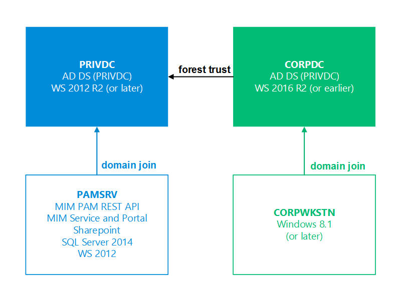

# Übersicht über die Umgebung
Diese Testumgebung umfasst Software, die auf vier physischen oder virtuellen Computern installiert werden kann, wie in Abbildung 1 dargestellt. Für die restlichen Anweisungen wird davon ausgegangen, dass die Installation auf virtuellen Computern ausgeführt wird, die sich ein gemeinsames privates Netzwerk (z. B. ein virtuelles LAN mit IP-Adressen, die Nummern wie 10.0.x.x oder 192.168.x.x aufweisen) teilen.

> [!IMPORTANT]
> Diese CTP-Version ist nicht mit den Datenbank- oder Verzeichnisinhalten der vorherigen CTP-Version kompatibel.  Wenn Sie zuvor bereits MIM für PAM oder andere Szenarien ausgewertet haben, sichern und archivieren Sie die für diesen Test verwendeten virtuellen Computer, und starten Sie die Bereitstellung mit neuen Images von virtuellen Computern, die nicht bereits für MIM-Szenarien verwendet wurden.

<!--HONumber=Mar16_HO1-->
