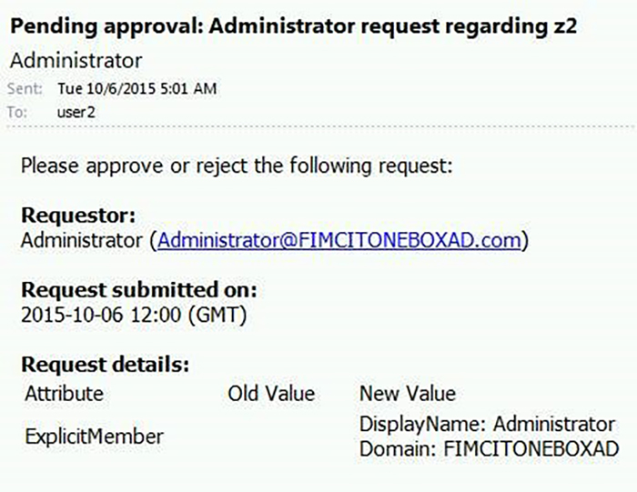

# FIM-Issues and Solutions
## Forefront Identity Manager Issues and Solutions
### Problemliste
[Benutzerattribute in Anfordern von Benachrichtigungen](#issue--user-attributes-in-request-notifications)
[Ein weiteres Problem](#another-issue)

### Problem: Benutzerattribute in Anfordern von Benachrichtigungen
Wenn ein Benutzer eine Anforderung zum Hinzufügen eines Benutzers zu einer Gruppe sendet, empfängt den Besitzer der Gruppe eine FIM generierte e-Mail, die in der die Anforderung genehmigen. Der Empfänger kann nicht feststellen, ob sie die Anforderung genehmigen soll, da standardmäßig FIM nur das neue Mitglied Anzeigenamen sendet. Anzeigenamen sind nicht eindeutig, z. B. "Administrator".   Weitere Attribute in der Anforderung in der e-Mail sind z. B. die Domäne des Benutzerkontos erforderlich.

### Lösung: Hinzufügen von Attributwerten
In der Genehmigung und Benachrichtigung e-Mails können die Attributwerte der angeforderten Änderung im Textkörper e-Mail-Nachricht gesendet werden, dazu in der e-Mail-Vorlage:

-  das Feld `[//RequestParameter/AllChangesAuthorizationTable]` ist dies ein *Autorisierung* Workflow oder
- das Feld `[//RequestParameter/AllChangesActionTable]` ist dabei ein *Aktion* Workflow.

Wenn der Requestor anfordert, Werte einen Verweis mehrwertige Attribut hinzufügen (z. B. das Hinzufügen eines Verweises auf eine Person als Wert für das ExplicitMember-Attribut der Gruppe), in der Regel nur eine Zeile in der Tabelle enthalten ist, und diese Zeile enthält den Anzeigenamen des angeforderten verknüpften Objekts (z. B. den Namen der Person).   

Ob andere oder zusätzliche Attribute des referenzierten Objekts in der e-Mail enthalten sein soll, können die Namen der Attribute in dieses Feld in der e-Mail-Vorlage enthalten sein.  Beispiel: `[//RequestParameter/AllChangesAuthorizationTable,”Domain”,”AccountName”,”DisplayName”]`

## Problem: Ein weiteres Problem
Anzahl vorigen Schritte blah
## Lösung: Eine andere Lösung
vorigen Schritte de vorigen Schritte blah
<!--HONumber=Mar16_HO1-->
