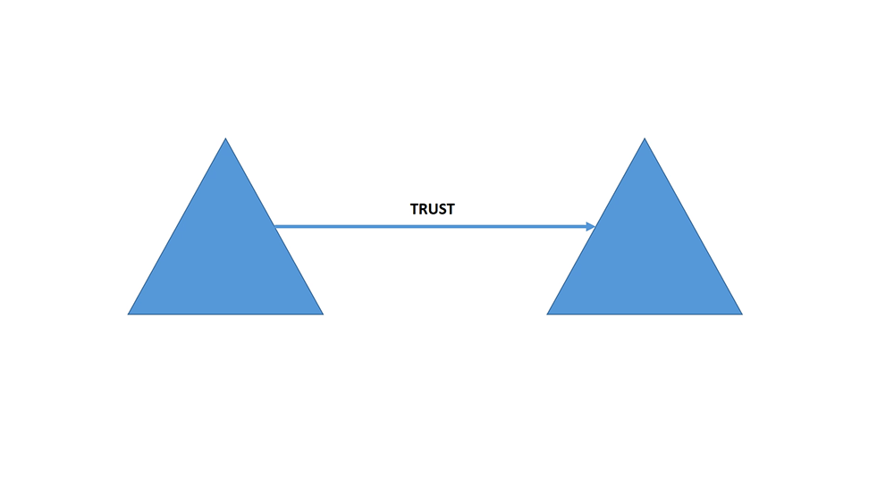

# FIM-Updates
## Forefront Identity Manager (FIM) aktualisiert.
### Updateliste
[Aktualisieren von 10/23/2015: Beschreibung-Titel](#update-10/23/2015--description-title)
[Aktualisieren von 10/24/2015: Beschreibung-Titel](#update-10/24/2015--description-title)
[Aktualisieren von 10/25/2015: Beschreibung-Titel](#update-10/25/2015--description-title)
[Aktualisieren von 10/26/2015: Beschreibung-Titel](#update-10/26/2015--description-title)

### Aktualisieren von 10/23/2015: Beschreibung-Titel
Hier wird die Beschreibung des Updates und Richtlinien für diesen Reader.
### Aktualisieren von 10/24/2015: Beschreibung-Titel
Hier wird die Beschreibung des Updates und Richtlinien für diesen Reader.
### Aktualisieren von 10/25/2015: Beschreibung-Titel
Hier wird die Beschreibung des Updates und Richtlinien für diesen Reader.
### Aktualisieren von 10/26/2015: Beschreibung-Titel
Hier wird die Beschreibung des Updates und Richtlinien für diesen Reader.
### Hier ist ein Test-aninmation

### Hier ist ein Javascript-Test.
<table>
    <tr>
        <td><a href="javascript:alert('hi');">Daten</a></td>
    </tr>
</table>
<!--HONumber=Mar16_HO1-->
