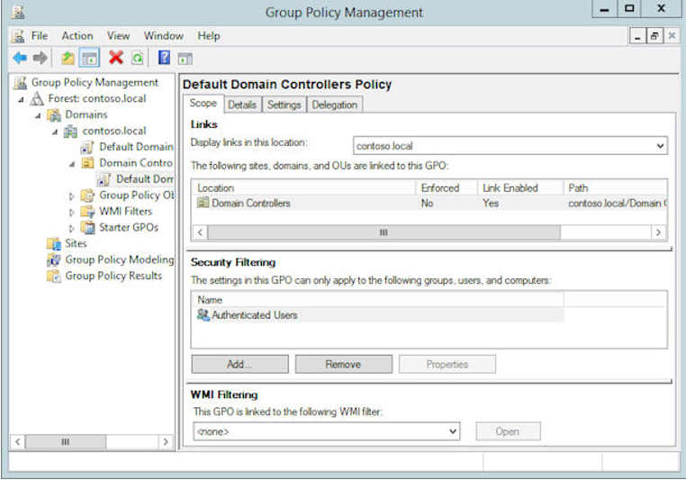

# Planen einer geschützten Umgebung

> [! Hinweis] {dieser Inhalt stammt aus dem Whitepaper "Mitigating Pass-the-Hash und andere Diebstahl von Anmeldeinformationen, Version 2", entwickelt von Microsoft Corporation Trustworthy Computing Group.}

## Übersicht
Durch das Hinzufügen einer geschützten Umgebung mit einer dedizierten administrativen Gesamtstruktur zu Active Directory sind Organisationen in der Lage, Administratorkonten, Arbeitsstationen und Gruppen problemlos zu verwalten. Dabei weist die Umgebung stärkere Sicherheitskontrollen auf als ihre vorhandene Produktionsumgebung.

Diese Architektur ermöglicht eine Reihe von Kontrollmechanismen, die in einer Architektur mit einer einzelnen Gesamtstruktur nicht möglich oder nicht einfach zu konfigurieren sind. Dieser Ansatz ermöglicht die Bereitstellung von Konten als Standardbenutzer ohne erweiterte Berechtigungen in der administrativen Gesamtstruktur, die in der Produktionsumgebung über weitgehende Berechtigungen verfügen, und somit eine umfassende technische Erzwingung von Governance. Zudem ermöglicht diese Architektur die Verwendung der ausgewählten Authentifizierung von Vertrauensstellungen zum Einschränken von Anmeldungen (und Offenlegen der Anmeldeinformationen) auf autorisierte Hosts. In Situationen, in denen eine umfassendere Sicherung für die Produktionsgesamtstruktur ohne die Kosten und Komplexität einer vollständigen Wiederherstellung erwünscht ist, kann eine administrative Gesamtstruktur eine Umgebung bereitstellen, in der für das Produktionsumfeld eine höhere Sicherheitsstufe gilt.

Zusätzlich zur dedizierten administrativen Gesamtstruktur können auch weitere Verfahren verwendet werden. Dazu gehören das Einschränken der Situationen, in denen Administratorrechte verfügbar gemacht werden, das Beschränken der Rollenberechtigungen der Benutzer in dieser Gesamtstruktur und das Sicherstellen, dass administrative Aufgaben nicht auf Hosts für Standardbenutzeraktivitäten (z. B. E-Mail oder Browsen im Internet) durchgeführt werden.

## Aspekte der Gesamtstruktur einer geschützten Umgebung

Eine dedizierte administrative Gesamtstruktur ist eine Active Directory-Standardgesamtstruktur mit einer einzelnen Domäne, die ausschließlich der Active Directory-Verwaltung dient. Aufgrund des begrenzten Einsatzgebiets können administrative Gesamtstrukturen und Domänen strikter abgesichert werden als Produktionsgesamtstrukturen. Da diese Gesamtstruktur abgetrennt ist und den bestehenden Gesamtstrukturen der Organisation nicht vertraut, ist sie zudem nicht gefährdet, falls sich zu einem späteren Zeitpunkt herausstellen sollte, dass eine andere Gesamtstruktur der Organisation manipuliert wurde.

Beim Entwurf einer administrativen Gesamtstruktur ist Folgendes zu berücksichtigen:

**Beschränkter Gültigkeitsbereich:** Der Wert einer administrativen Gesamtstruktur liegt in der hohen Sicherheitsstufe und der verringerten Angriffsfläche, die zu einem geringeren Restrisiko führen. Die Gesamtstruktur kann für zusätzliche Verwaltungsfunktionen und -anwendungen verwendet werden, jede Erweiterung des Bereichs vergrößert jedoch die Angriffsfläche der Gesamtstruktur und ihrer Ressourcen. Das Ziel ist die Einschränkung der Funktionen der Gesamtstruktur und ihrer Administratorbenutzer, um die Angriffsfläche minimal zu halten, daher sollte jede Erweiterung des Bereichs sorgfältig durchdacht werden. Die Konten in einer dedizierten administrativen Gesamtstruktur sollten sich auf einer einzelnen Ebene befinden, in der Regel Ebene 0 oder 1. Ebene 1 kann zudem weiter auf einen bestimmten Anwendungsbereich (z. B. Finanz-Apps) oder eine Benutzercommunity (z. B. externe IT-Anbieter) beschränkt werden.

**Eingeschränkte Vertrauenswürdigkeit:** Die Konfiguration von Vertrauensstellungen wird von verwalteten Gesamtstrukturen oder Domänen zur administrativen Gesamtstruktur verlagert.

- Von der Produktionsumgebung zur administrativen Gesamtstruktur ist eine unidirektionale Vertrauensstellung erforderlich. Dabei kann es sich um eine Domänen- oder Gesamtstruktur-Vertrauensstellung handeln. Die administrative Gesamtstruktur muss den verwalteten Domänen und Gesamtstrukturen nicht vertrauen, um Active Directory verwalten zu können. Zusätzliche Anwendungen können jedoch eine bidirektionale Vertrauensstellung, Sicherheitsüberprüfungen und Tests erfordern.

- Um Konten in der administrativen Gesamtstruktur auf die Protokollierung auf den richtigen Produktionshosts zu beschränken, sollte die ausgewählte Authentifizierung verwendet werden. Zur Verwaltung von Domänencontrollern und Delegierung von Rechten in Active Directory ist hierbei in der Regel die Berechtigung für die Anmeldung auf Domänencontrollern für die jeweiligen Administratorkonten der Ebene 0 in der administrativen Gesamtstruktur erforderlich. Finden Sie unter [selektive Authentifizierungseinstellungen konfigurieren](http://technet.microsoft.com/library/cc755844.aspx) Weitere Informationen.

## Bereitstellen der Gesamtstruktur

Im Kern enthält eine geschützte Umgebung eine Sammlung von Active Directory-Domänencontrollerservern für Authentifizierung und Autorisierung und Microsoft Identity Manager-Servern für das Lifecycle Management von privilegierten Konten und die Verarbeitung von Anforderungsworkflows. Außerdem schließt sie privilegierte Administratorarbeitsstationen ein, über die sich Administratoren authentifizieren können.

### Verwaltung der logischen Trennung

Um sicherzustellen, dass die geschützte Umgebung nicht durch bestehende oder zukünftige Sicherheitsvorfälle im vorhandenen Active Directory beeinträchtigt wird, sollten bei der Vorbereitung von Systemen für die geschützte Umgebung die folgenden Richtlinien berücksichtigt werden:

- Windows-Server sollten nicht in Domänen der vorhandenen Umgebung eingebunden werden oder Software oder verteilte Einstellungen von dieser nutzen.

- Die geschützte Umgebung muss eigene Active Directory-Domänendienste aufweisen, die Kerberos, LDAP, DNS und Zeitdienste für die geschützte Umgebung bereitstellen. Auf den Servern für die Bereitstellung von Active Directory-Domänendienste muss Windows Server 2012 R2 oder höher ausgeführt werden. Dies gilt auch für die Funktionsebene der Gesamtstruktur.

- Microsoft Identity Manager erfordert SQL Server 2012 Service Pack 1 oder SQL Server 2014. Diese Komponente sollte auf dedizierten Servern in der geschützten Umgebung bereitgestellt werden. MIM darf keine SQL-Datenbankfarm in der bestehenden Umgebung nutzen.

- In der geschützten Umgebung muss Microsoft Identity Manager 2016 für das PAM-Szenario bereitgestellt werden, insbesondere müssen der MIM-Dienst und die PAM-Komponenten bereitgestellt werden.

- Sicherungssoftware und Medien für die geschützte Umgebung müssen getrennt von denen für Systeme in den bestehenden Gesamtstrukturen gehalten werden, damit Administratoren in der bestehenden Gesamtstruktur nicht in der Lage sind, eine Sicherung der geschützten Umgebung zu manipulieren.

- Benutzer, die die geschützte Umgebung verwalten, müssen sich von Arbeitsstationen aus anmelden, die nicht für Administratoren in der bestehenden Umgebung zugänglich sind, damit die Anmeldeinformationen für die geschützten Umgebung nicht weitergegeben werden können. Die Bereitstellung und Sicherung dedizierter administrativer Arbeitsstationen wird im Folgenden beschrieben.

### Sicherstellen der Verfügbarkeit von Verwaltungsdiensten aus der geschützten Umgebung

Während die Verwaltung von Anwendungen in der bestehenden Gesamtstruktur in die geschützte Umgebung überführt wird, muss für die Planung der Bereitstellung der geschützten Umgebung eine ausreichende Verfügbarkeit für die Anforderungen dieser Anwendungen berücksichtigt werden. Die Methoden umfassen Folgendes:

- Bereitstellen von Active Directory-Domänendiensten auf mehreren Computern in der geschützten Umgebung. Es sind mindestens zwei erforderlich, um eine fortgesetzte Authentifizierung sicherzustellen, auch wenn ein Server aufgrund von geplanter Wartung vorübergehend neu gestartet wird. Möglicherweise sind zusätzliche Computer erforderlich, um eine höhere Auslastung zu verarbeiten oder wenn die Organisation über Ressourcen und Administratoren in mehreren geografischen Regionen verfügt.

- Vorbereiten von Notfallkonten („Break Glass-Konten“) in der dedizierten administrativen Gesamtstruktur und in der Gesamtstruktur für Ausnahmesituationen.

- Bereitstellen von SQL Server und dem MIM-Dienst auf mehreren Computern in der geschützten Umgebung.

- Verwalten einer Sicherungskopie von AD und SQL bei jeder Änderung von Benutzern oder Rollendefinitionen in der Gesamtstruktur zur Wiederherstellung im Notfall.

### Konfigurieren geeigneter Active Directory-Berechtigungen

Die administrative Gesamtstruktur sollte anhand der geringsten erforderlichen Rechte für die Active Directory-Verwaltung konfiguriert werden.

- Konten in der administrativen Gesamtstruktur, die für die Verwaltung der Produktionsumgebung verwendet werden, sollten keine Administratorberechtigungen für die administrative Gesamtstruktur oder die enthaltenen Domänen oder Arbeitsstationen erhalten.

Wenn beispielsweise Alice für den Betrieb der geschützten Umgebung verantwortlich ist, Bob die Rolle für die Exchange-Verwaltung zugeteilt wurde und Carol ein Exchange-Administrator ist, müssen weder Bob noch Carol der Gruppe „Administratoren“ in der dedizierten administrativen Gesamtstruktur angehören.

- Administratorrechte für die administrative Gesamtstruktur selbst sollten über ein Offlineverfahren streng kontrolliert werden, um das Löschen von Überwachungsprotokollen durch Angreifer oder böswillige Mitarbeiter zu erschweren. Dies trägt auch dazu bei, dass Mitarbeiter mit Administratorkonten für die Produktion die Einschränkungen ihrer Konten nicht lockern und damit das Risiko für die Organisation steigern können.

- Die administrative Gesamtstruktur sollte die Microsoft Security Compliance Manager-Konfigurationen (SCM) für die Domäne befolgen, einschließlich sicherer Konfigurationen für Authentifizierungsprotokolle.

Sie müssen beim Erstellen der geschützten Umgebung vor der Installation von Microsoft Identity Manager die Konten identifizieren und erstellen, die für die Verwaltung dieser Umgebung verwendet werden. Dazu gehören:

- **Notfallkonten:** Diese Konten sollten sich nur bei den Domänencontrollern in der geschützten Umgebung anmelden können.

- **„Rote Karte“-Administratoren:** Diese Benutzerkonten stellen andere Konten bereit und führen ungeplante Wartungen durch. Diesen Konten wird kein Zugriff auf bestehende Gesamtstrukturen oder Systeme außerhalb der geschützten Umgebung gewährt. Die Anmeldeinformationen, z. B. eine Smartcard, sollten physisch sicher aufbewahrt werden, und die Verwendung dieser Konten sollte protokolliert werden.

- **Dienstkonten:** Diese werden von Microsoft Identity Manager, SQL Server und anderer Software benötigt, die in der geschützten Umgebung installiert ist.

### Integration mit SIEM und Verhaltensanalysetools

Erkennungskontrollen für die administrative Gesamtstruktur sollten bei Anomalien in der administrativen Gesamtstruktur Warnungen ausgeben. Die begrenzte Anzahl von autorisierten Szenarios und Aktivitäten trägt dazu bei, diese Kontrollen präziser als die Produktionsumgebung zu optimieren. Dies kann das Exportieren der Protokolle aus Active Directory und Microsoft Identity Manager auf ein SIEM-System für die Analyse einschließen.

### Absichern von Hosts

Alle Hosts, einschließlich Domänencontrollern, Servern und Arbeitsstationen, die Mitglied der administrativen Gesamtstruktur sind, müssen mit den neuesten Betriebssystemen und Servicepacks ausgestattet sein und auf dem aktuellen Stand gehalten werden. Darüber hinaus gilt:

- Die Anwendungen für die Umsetzung der Verwaltung sollten auf Arbeitsstationen vorinstalliert werden, sodass Konten nicht der lokalen Administratorgruppe angehören müssen, um sie zu installieren. Die Wartung der Domänencontroller kann in der Regel mit RDP und Remote Server Administration Tools ausgeführt werden.

- Hosts in der administrativen Gesamtstruktur sollten automatisch mit Sicherheitsupdates aktualisiert werden. Dies birgt zwar das Risiko einer Unterbrechung des Domänencontroller-Wartungsbetriebs, bietet jedoch eine erhebliche Verringerung von Sicherheitsrisiken durch nicht behobene Schwachstellen.

Windows Server Update Services können so konfiguriert werden, dass Updates automatisch genehmigt werden. Weitere Informationen finden Sie im Abschnitt „Automatisches Genehmigen der Installation von Updates“ des Dokuments „Genehmigen von Updates“.

#### Absichern von Arbeitsstationen

Alle Hosts, auf denen Administratoren Anmeldeinformationen eingeben oder administrative Aufgaben erledigen, erhalten die Berechtigungen des entsprechenden Kontos, auch wenn dies nur vorübergehend geschieht. Das Eingeben eines Kennworts, einer Smartcard-PIN oder anderer Überprüfungsangaben oder das Verbinden eines physischen Authentifizierungsgeräts führt dazu, dass diesem Computer die Berechtigungen für die Anmeldeinformationen erteilt werden. Das Risiko eines System sollte nach der Aktivität mit dem höchsten Risiko, die auf ihm ausgeführt wird, bewertet werden, z. B. Browsen im Internet, Senden und Empfangen von E-Mails oder Verwenden anderer Anwendungen, die unbekannte oder nicht vertrauenswürdige Inhalte verarbeiten.

Zu den administrativen Hosts gehören die folgenden Computer:

- Ein Desktopcomputer, auf dem Anmeldeinformationen des Administrators eingegeben werden.

- Administrative „Wechselserver“, auf denen administrativen Sitzungen und Tools ausgeführt werden.

- Alle Hosts, auf denen administrative Aktionen durchgeführt werden, einschließlich solcher, bei denen Server und Anwendungen über einen Standard-Benutzerdesktop, auf dem ein RDP-Client ausgeführt wird, remote verwaltet werden.

- Server, auf denen Anwendungen gehostet werden, die verwaltet werden müssen und auf die nicht mit RDP im eingeschränkten Administratormodus oder mit Windows PowerShell-Remoting zugegriffen wird.

#### Bereitstellen von dedizierten administrativen Arbeitsstationen

Separate abgesicherte Arbeitsstationen, die ausschließlich für Benutzer mit umfassenden administrativen Anmeldeinformationen verwendet werden, sind zwar unpraktisch, jedoch möglicherweise erforderlich, um auf einem Host das gleiche oder ein höheres Maß an Sicherheit bereitzustellen wie durch die Anmeldeinformationen gewährleistet wird. Das Beibehalten der Sicherheit gegenüber einem entschlossenen und talentierten Angreifer erfordert möglicherweise zusätzliche Maßnahmen, beispielsweise:

- **Überprüfung aller Medien im Build** , um das Risiko durch Malware zu verringern, die in einem Masterimage installiert ist oder während des Downloads oder der Speicherung in eine Installationsdateidatei eingefügt wird.

- **Sicherheitsbaselines** sollten als Ausgangskonfiguration verwendet werden.

Kunden können Microsoft Security Compliance Manager (SCM) zum Konfigurieren von Baselines auf den administrativen Hosts verwenden.

- **Sicherer Start** zur Abhilfe gegen Angreifer oder Malware, die versuchen, während des Startvorgangs nicht signierten Code zu laden.

Diese Funktion wurde in Windows 8 eingeführt, um UEFI (Unified Extensible Firmware Interface) zu nutzen.

- **Softwareeinschränkungen** , um sicherzustellen, dass nur autorisierte Verwaltungssoftware auf den administrativen Hosts ausgeführt wird.

Kunden können für diesen Vorgang AppLocker mit einer Whitelist autorisierter Anwendungen verwenden, um zu verhindern, dass Malware oder nicht unterstützte Anwendungen ausgeführt werden.

- **Verschlüsselung ganzer Volumes** zur Verringerung des Risikos durch den Verlust physischer Computer, z. B. administrativer Laptops, die an Remotestandorten eingesetzt werden.

- **USB-Einschränkungen** zum Schutz vor physischen Infektionsvektoren.

- **Netzwerkisolation** zum Schutz vor Netzwerkangriffen und unbeabsichtigten Administratoraktionen. Hostfirewalls sollten alle eingehenden Verbindungen, mit Ausnahme der ausdrücklich erforderlichen, und sämtliche nicht benötigten ausgehenden Internetzugriffe sperren.

- **Antimalware** zum Schutz vor bekannten Risiken und Malware.

- **Schutzmaßnahmen gegen Exploits** zum Verringern der Risiken durch unbekannte Gefahren und Exploits, einschließlich des Enhanced Mitigation Experience Toolkit (EMET).

- **Analyse der Angriffsfläche** zum Verhindern der Einführung neuer Angriffsvektoren auf Windows während der Installation von neuer Software.

Die Verwendung von Tools wie Attack Surface Analyzer (ASA) trägt dazu bei, die Konfigurationseinstellungen auf einem Host auszuwerten und Angriffsvektoren zu identifizieren, die durch Software oder Konfigurationsänderungen eingeführt werden.

- Benutzer sollten keine Administratorrechte für lokale Computer benötigen.

- Ausgehende RDP-Sitzungen sollten den RestrictedAdmin-Modus aufweisen, sofern die Rolle nichts anderes erfordert. Weitere Informationen finden Sie unter [Neues in den Remotedesktopdiensten unter Windows Server](https://technet.microsoft.com/en-us/library/dn283323.aspx) .

Einige dieser Maßnahmen erscheinen möglicherweise extrem, doch haben viele Nachrichten in den letzten Jahren aufgezeigt, welche umfassenden Fähigkeiten erfahrene Angreifer einsetzen, um Ziele zu manipulieren.

### Einrichten von Vertrauensstellungen und Vorbereiten von bestehenden Domänen für die Verwaltung aus der geschützten Umgebung

MIM enthält PowerShell-Cmdlets, die dabei helfen, Vertrauensstellungen zwischen den bestehenden AD-Domänen und der dedizierten administrativen Gesamtstruktur in der geschützten Umgebung einzurichten. Nach der Bereitstellung der geschützten Umgebung und bevor Benutzer oder Gruppen in JIT konvertiert wurden, aktualisieren die Cmdlets „New-PAMTrust“ und „New-PAMDomainConfiguration“ die Vertrauensstellungen zwischen den Domänen und erstellen für AD und MIM erforderliche Artefakte.

Bei Änderungen der bestehenden Active Directory-Topologie können mit den Cmdlets `Test-PAMTrust`, `Test-PAMDomainConfiguration`, `Remove-PAMTrust` und `Remove-PAMDomainConfiguration` die Vertrauensstellungen aktualisiert werden.

#### Verfahren zum Einrichten von Vertrauensstellungen für die einzelnen Gesamtstrukturen

Das Cmdlet „New-PAMTrust“ muss einmal für jede bestehende Gesamtstruktur ausgeführt werden. Er wird auf dem Computer des MIM-Diensts in der administrativen Domäne aufgerufen. Die Parameter für diesen Befehl sind der Domänenname der obersten Domäne in der bestehenden Gesamtstruktur und die Anmeldeinformationen eines Administrators dieser Domäne.

```
New-PAMTrust -SourceForest "contoso.local" -Credentials (get-credential)
```

Nach dem Einrichten der Vertrauensstellung konfigurieren Sie jede Domäne für die Verwaltung über die geschützte Umgebung, wie im nächsten Abschnitt beschrieben.

#### Verfahren zum Aktivieren der Verwaltung der einzelnen Domänen

Es gibt sieben Anforderungen für die Aktivierung der Verwaltung für eine bestehende Domäne.

1. Es muss eine Gruppe in der vorhandenen Domäne geben, deren Name dem NetBIOS-Domänennamen gefolgt von drei Dollarzeichen entspricht, z. B. „CONTOSO$$$“. Der Gruppenbereich muss „Lokal (in Domäne)“ sein, und der Gruppentyp muss „Sicherheit“ sein. Dies ist erforderlich, damit in der dedizierten administrativen Gesamtstruktur erstellte Gruppen dieselbe Sicherheits-ID wie Gruppen in dieser Domäne aufweisen. Dies kann mit dem folgenden PowerShell-Befehl durchgeführt werden, der von einem Administrator der bestehenden Domäne auf einer Arbeitsstation ausgeführt wird, die der bestehenden Domäne beigetreten ist:

```
New-ADGroup -name 'CONTOSO$$$' -GroupCategory Security -GroupScope DomainLocal -SamAccountName 'CONTOSO$$$'
```

2. Die Gruppenrichtlinieneinstellungen auf dem Domänencontroller für die Überwachung müssen sowohl Erfolgs- als auch Fehlerüberwachung für „Kontenverwaltung überwachen“ und „Verzeichniszugriff überwachen“ aufweisen. Sie können über die Gruppenrichtlinien-Verwaltungskonsole eingerichtet werden, die von einem Administrator der bestehenden Domäne auf einer Arbeitsstation ausgeführt wird, die der bestehenden Domäne beigetreten ist:

3. **Konfigurieren der Überprüfung:** Wechseln Sie zu „Start“ &gt; „Verwaltung“, und starten Sie „Gruppenrichtlinienverwaltung“.

4. Navigieren Sie zu „Gesamtstruktur“: „contoso.local“, „Domänen“, „contoso.local“, „Domänencontroller“, „Standarddomänencontroller-Richtlinie“. Es wird eine informierende Meldung angezeigt.



5. Klicken Sie mit der rechten Maustaste auf „Standarddomänencontroller-Richtlinie“, und wählen Sie im Kontextmenü den Befehl „Bearbeiten“ aus. Ein neues Fenster wird angezeigt.

6. Navigieren Sie im Fenster „Gruppenrichtlinienverwaltungs-Editor“ unter „Standarddomänencontroller-Richtlinie“ zu „Computerkonfiguration“ > „Richtlinien“ > „Windows-Einstellungen“ > „Sicherheitseinstellungen“ > „Lokale Richtlinien“ > „Überwachungsrichtlinie“, und erweitern Sie diese.


5. Klicken Sie im Detailbereich mit der rechten Maustaste auf „Kontenverwaltung überwachen“, und wählen Sie im Kontextmenü die Option „Eigenschaften“ aus. Klicken Sie auf „Diese Richtlinieneinstellungen definieren“, aktivieren Sie das Kontrollkästchen „Erfolg“, dann das Kontrollkästchen „Fehler“, und klicken Sie anschließend auf „Übernehmen“ und „OK“.

6. Klicken Sie im Detailbereich mit der rechten Maustaste auf „Verzeichnisdienstzugriff überwachen“, und wählen Sie im Kontextmenü den Befehl „Eigenschaften“ aus. Klicken Sie auf „Diese Richtlinieneinstellungen definieren“, aktivieren Sie das Kontrollkästchen „Erfolg“, dann das Kontrollkästchen „Fehler“, und klicken Sie anschließend auf „Übernehmen“ und „OK“.


7. Schließen Sie die Fenster „Gruppenrichtlinienverwaltungs-Editor“ und „Gruppenrichtlinienverwaltung“. Wenden Sie dann die Überwachungseinstellungen an, indem Sie ein PowerShell-Fenster starten und Folgendes eingeben:

```
gpupdate /force /target:computere
```

Die Meldung „Die Aktualisierung der Computerrichtlinie wurde erfolgreich abgeschlossen.“ sollte nach einigen Minuten angezeigt werden.

8. Die Domänencontroller müssen RPC über TCP/IP-Verbindungen für LSA aus der geschützten Umgebung zulassen. Auf älteren Versionen von Windows Server muss die TCP/IP-Unterstützung in LSA in der Registrierung aktiviert werden:

```
New-ItemProperty -Path HKLM:SYSTEM\\CurrentControlSet\\Control\\Lsa -Name TcpipClientSupport -PropertyType DWORD -Value 1
```

9. Das Cmdlet `New-PAMDomainConfiguration` muss auf dem Computer des MIM-Diensts in der administrativen Domäne ausgeführt werden. Die Parameter für diesen Befehl sind der Domänenname der bestehenden Domäne und die Anmeldeinformationen eines Administrators dieser Domäne.

```
 New-PAMDomainConfiguration -SourceDomain "contoso" -Credentials (get-credential)
```

10. Die Konten in der geschützten Gesamtstruktur, über die Rollen eingerichtet werden (Administratoren, die die Cmdlets `New-PAMUser` und `New-PAMGroup` verwenden) sowie das vom MIM-Überwachungsdienst verwendete Konto benötigen Leseberechtigungen in der Domäne.

Wenn beispielsweise „CORPDC“ ein Domänencontroller der bestehenden Domäne „CONTOSO“ und „PRIV\\Administrator“ der Benutzer in der geschützten Umgebung ist, der Lesezugriff benötigt, dann aktivieren die folgenden Schritte den Lesezugriff auf die Domäne durch einen Administrator und den Überwachungsdienst.

11. **Aktivieren Sie auf „CORPDC“ den Lesezugriff auf AD für PRIV-Administratoren und den Überwachungsdienst.** Stellen Sie sicher, dass Sie auf „CORPDC“ als Contoso-Domänenadministrator angemeldet sind (z. B. „Contoso\Administrator“).

12. Starten Sie Active Directory-Benutzer und -Computer.

13. Klicken Sie mit der rechten Maustaste auf die Domäne „contoso.local“, und wählen Sie „Objektverwaltung zuweisen“ aus.

14. Klicken Sie auf der Registerkarte „Ausgewählte Benutzer und Gruppen“ auf „Hinzufügen“.

15. Klicken Sie im Popupfenster zur Auswahl von Benutzern, Computern oder Gruppen auf „Speicherorte“, und ändern Sie den Speicherort in „priv.contoso.local“. Geben Sie für den Objektnamen „Domänen-Admins“ ein, und klicken Sie dann auf „Namen überprüfen“. Wenn ein Popupfenster angezeigt wird, geben Sie den Benutzernamen „priv\administrator“ sowie das Kennwort ein.

16. Geben Sie hinter „Domänen-Admins“ die Zeichenfolge „; MIMMonitor“ ein. Nachdem die Namen „Domänen-Admins“ und „MIMMonitor“ unterstrichen sind, klicken Sie auf „OK“ und dann auf „Weiter“.

17. Wählen Sie in der Liste der allgemeinen Aufgaben „Liest alle Benutzerinformationen“ aus, und klicken Sie auf „Weiter“ und dann auf „Fertig stellen“.

18. Schließen Sie %%amp;quot;Active Directory-Benutzer und -Computer%%amp;quot;.

> [! Hinweis] {ist das Ziel des Projekts Management privilegierten Zugriff reduzieren Sie die Anzahl der Konten mit Domänenadministrator-Berechtigungen, die permanent mit der Domäne zugewiesen, es muss ein *Glas unterbrechen* Konto in der Domäne, für den Fall, dass ein höher Problem bei der Vertrauensstellung vorliegt. Konten für den Notfallzugriff auf die Produktionsgesamtstruktur sollten in jeder Domäne vorhanden sein und sich ausschließlich bei Domänencontrollern anmelden können. Für Organisationen mit mehreren Standorten sind aus Redundanzgründen möglicherweise zusätzliche Konten erforderlich.}

19. Überprüfen Sie abschließend die Berechtigungen im *AdminSDHolder* -Objekt im Systemcontainer dieser Domäne. Das *AdminSDHolder* -Objekt enthält eine eindeutige Zugriffssteuerungsliste (ACL), mit der die Berechtigungen von Sicherheitsprinzipalen gesteuert werden, die Mitglieder der integrierten privilegierten Active Directory-Gruppen sind. Wenn Änderungen an den Standardberechtigungen vorgenommen wurden, die Auswirkungen auf Benutzer mit Administratorrechten in der Domäne hätten, werden diese Berechtigungen nicht für Benutzer übernommen, deren Konten sich in der geschützten Umgebung befinden.

### Auswählen von Benutzern und Gruppen für die Aufnahme

Der nächste Schritt besteht im Definieren der PAM-Rollen und im Zuordnen der Benutzer und Gruppen, auf die diese Zugriff haben sollten. Dabei handelt es sich in der Regel um eine Teilmenge der Benutzer und Gruppen für die Ebene, bei denen erkannt wurde, dass sie in der geschützten Umgebung verwaltet werden. Weitere Informationen finden Sie in [Definieren von Rollen für die privilegierte Zugriffsverwaltung](defining-roles-for-pam.md).
<!--HONumber=Mar16_HO1-->
