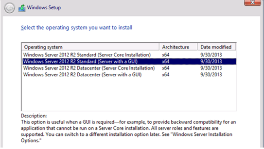

# Schritt 3: Vorbereiten eines PAM-Servers

1.  Installieren Sie Windows Server 2012 R2, insbesondere Windows Server 2012 R2 Standard (Server mit Benutzeroberfläche) x 64, um einen neuen Computer auf einem dritten virtuellen Computer "*PAMSRV*".   Beachten Sie, dass mindestens 8 GB RAM erforderlich sind, weil SQL Server und SharePoint 2013 auf diesem Computer installiert werden.

    1.  Geben Sie „Windows Server 2012 R2 Standard (Server mit grafischer Benutzeroberfläche)“ x64 an.

        

    2.  Lesen und akzeptieren Sie die Lizenzbedingungen.

    3.  Da der Datenträger leer ist, wählen Sie **Benutzerdefiniert: nur Windows installieren** und verwenden Sie den nicht initialisierten Speicherplatz.

2.  Melden Sie sich bei dem neuen Computer als Administrator an.  Geben sie eine statische IP-Adresse im virtuellen Netzwerk, konfigurieren Sie die Netzwerkschnittstelle zum Senden von DNS-Abfragen an die IP-Adresse mithilfe der Systemsteuerung, **PRIVDC** und legen Sie den Computernamen auf **PAMSRV**.  Dies erfordert einen Neustart des Servers.

3.  Ist über das virtuelle Netzwerk keine Internetverbindung möglich, fügen Sie dem Computer eine weitere Netzwerkschnittstelle hinzu, die eine Verbindung mit dem Internet ermöglicht.  Dies ist für die SharePoint-Installation erforderlich und kann deaktiviert werden, nachdem dieser Schritt abgeschlossen ist.

4.  Nachdem der Server neu gestartet wurde, melden Sie sich als Administrator an. Konfigurieren Sie den Computer mithilfe der Systemsteuerung, um nach Updates zu suchen und ggf. alle erforderlichen Updates zu installieren.  Dies erfordert möglicherweise einen Neustart des Servers.

5.  Nachdem der Server neu gestartet wird, melden Sie sich als Administrator, öffnen Sie die Systemsteuerung und den Join **PAMSRV** an die **PRIV** Domäne (*priv.contoso.local*).  Dies erfordert, dass die Benutzernamen und Anmeldeinformationen bereitstellen einer **PRIV** Domänenadministrator wie z. B. *PRIV\Administrator*. Nachdem die Willkommensnachricht angezeigt wird, schließen Sie das Dialogfeld, und starten Sie den Server neu.

6.  Starten Sie den Computer **PAMSRV** und melden Sie sich als eine **PRIV** Domänenadministrator wie z. B. *PRIV\Administrator*.

7.  Fügen Sie die Rollen "Webserver (IIS)" und "Anwendungsserver", die .NET Framework 3.5-Features, das Active Directory-Modul für Windows PowerShell und weitere Features hinzu, die für SharePoint erforderlich sind.

    1.  Starten Sie PowerShell, während Sie als Administrator angemeldet sind.

    2.  Geben Sie die folgenden Befehle ein.   Möglicherweise ist es notwendig, dass Sie einen anderen Speicherort für die Quelldateien für .NET Framework 3.5-Features angeben. Diese Features sind in der Regel nicht vorhanden, wenn WindowsServer installiert wird, aber verfügbar sind, im Ordner Side-by-Side (SxS) auf dem Datenträger Ordner Datenquellen, z. B. "* d:\Sources\SxS\*".

        ```
        import-module ServerManager
        Install-WindowsFeature Web-WebServer, Net-Framework-Features,rsat-ad-powershell,Web-Mgmt-Tools,Application-Server,Windows-Identity-Foundation,Server-Media-Foundation,Xps-Viewer –includeallsubfeature -restart -source d:\sources\SxS
        ```

8.  Konfigurieren Sie die Serversicherheitsrichtlinien, damit die neu erstellten Konten als Dienste ausgeführt werden können.

    1.  Starten Sie das Programm **Lokale Sicherheitsrichtlinie** .

    2.  Navigieren Sie zu **Lokale Richtlinien» zuweisen von Benutzerrechten**.

    3.  Auf der **im Detailbereich**, klicken Sie mit der rechten Maustaste auf **Anmelden als Dienst**, und wählen Sie **Eigenschaften**.

    4.  Klicken Sie auf **Benutzer oder Gruppe hinzufügen**, und geben Sie im Benutzer- und Gruppennamen *Priv\mimmonitor; Priv\MIMService; Priv\SharePoint; Priv\mimcomponent; Priv\SqlServer*, klicken Sie auf **Namen überprüfen**, und klicken Sie auf **OK**.

    5.  Klicken Sie auf **OK** , um das Eigenschaftenfenster „Anmelden als Dienst“ zu schließen.

    6.  Auf der **im Detailbereich**, klicken Sie mit der rechten Maustaste auf **Zugriff vom Netzwerk auf diesen Computer Verweigern**, und wählen Sie **Eigenschaften**.

    7.  Klicken Sie auf **Benutzer oder Gruppe hinzufügen**, und geben Sie im Benutzer- und Gruppennamen *Priv\mimmonitor; Priv\MIMService; Priv\mimcomponent* und klicken Sie auf **OK**.

    8.  Klicken Sie auf **OK** Zugriff verweigern für diesen Computer aus dem Netzwerk-Eigenschaften-Fenster zu schließen.

    9. Auf der **im Detailbereich**, klicken Sie mit der rechten Maustaste auf **Lokal anmelden verweigern**, und wählen Sie **Eigenschaften**.

    10. Klicken Sie auf **Benutzer oder Gruppe hinzufügen**, und geben Sie im Benutzer- und Gruppennamen *Priv\mimmonitor; Priv\MIMService; Priv\mimcomponent* und klicken Sie auf **OK**.

    11. Klicken Sie auf **OK** schließen Sie das Fenster Lokal anmelden verweigern.

    12. **Schließen** Fenster Lokale Sicherheitsrichtlinie.

9. Ändern Sie die IIS-Konfiguration, um es Anwendungen zu ermöglichen, die Windows-Authentifizierung zu nutzen.

    1.  Öffnen eines PowerShell-Fensters

    2.  Beenden Sie IIS, und verwenden Sie die folgenden Befehle, um die Hosteinstellungen der Anwendung zu entsperren:

        ```
        iisreset /STOP
        C:\Windows\System32\inetsrv\appcmd.exe unlock config /section:windowsAuthentication -commit:apphost
        iisreset /START
        ```

    3.  Alternativ können Sie mit einem Texteditor wie Editor die folgende Datei öffnen:
        C:\Windows\System32\inetsrv\config\applicationHost.config
        und Ersetzen Sie in Zeile 82 dieser Datei den Tagwert der *OverrideModeDefault*:

        & Lt; Abschnittsname = "Windows-Authentifizierung" OverrideModeDefault = "Deny" / & Gt;

        mit

        & Lt; Abschnittsname = "Windows-Authentifizierung" OverrideModeDefault = "Zulassen" / & Gt;

        Anschließend speichern Sie die Datei, und starten Sie IIS mit dem Befehl *Iisreset/Start*

10. Installieren Sie **SQL Server 2012 Service Pack 1** oder höher, oder **SQL Server 2014**. Die folgenden Schritte gelten für SQL 2014.

    1.  Starten Sie PowerShell als Domänenadministrator.

    2.  Navigieren Sie in das Verzeichnis, in dem sich das SQL Server-Setupprogramm befindet.

    3.  Geben Sie die folgenden Befehle ein.

        ```
        .\setup.exe /Q /IACCEPTSQLSERVERLICENSETERMS /ACTION=install /FEATURES=SQL,SSMS /INSTANCENAME=MSSQLSERVER /SQLSVCACCOUNT="PRIV\SqlServer" /SQLSVCPASSWORD="Pass@word1"   /AGTSVCSTARTUPTYPE=Automatic /AGTSVCACCOUNT="NT AUTHORITY\Network Service" /SQLSYSADMINACCOUNTS="PRIV\Administrator"
        ```

11. Mithilfe der **SharePoint Foundation 2013 mit SP1-Installationsprogramm**, installieren Sie SharePoint Softwarekomponenten auf *PAMSRV*.  Beachten Sie, dass dies einen Neustart des Servers veranlasst und eine Internetverbindung für diesen Computer erfordert, damit das Installationsprogramm die erforderlichen Komponenten herunterladen kann.

    1.  Starten Sie PowerShell als Domänenadministrator.

    2.  Wechseln Sie in das Verzeichnis, in dem SharePoint entpackt wurde.

    3.  Geben Sie den nachfolgend beschriebenen Befehl ein.

        ```
        .\prerequisiteinstaller.exe
        ```

12. Nach der Installation der erforderlichen Komponenten für SharePoint installieren **SharePoint Foundation 2013 mit SP1**.

    1.  Starten Sie PowerShell als Domänenadministrator.

    2.  Wechseln Sie in das Verzeichnis, in dem SharePoint entpackt wurde.

    3.  Geben Sie folgenden Befehl ein.

        ```
        .\setup.exe
        ```

    4.  Wählen Sie den Typ für einen vollständigen Server aus.

    5.  Nachdem die Installation abgeschlossen ist, wählen Sie die Option zum Ausführen des Assistenten aus.

13. Führen Sie den **Konfigurations-Assistenten für SharePoint-Produkte** aus, um SharePoint zu konfigurieren.

    1.  Wechseln Sie auf der Registerkarte „Verbindung mit einer Serverfarm herstellen“, um eine neue Serverfarm erstellen.

    2.  Geben Sie **PAMSRV** als Datenbankserver für die Konfigurationsdatenbank und **PRIV\SharePoint** als das Datenbankzugriffskonto für SharePoint verwendet werden.

    3.  Geben Sie ein Kennwort als Passphrase der Farmsicherheit an (die Passphrase wird später nicht in dieser Testumgebung verwendet).

    4.  Akzeptieren Sie für diese Testumgebung die weiteren Standardeinstellungen des SharePoint-Konfigurations-Assistenten.

    5.  Wenn der Konfigurations-Assistent die Konfigurationsaufgabe 10 von 10 abgeschlossen ist, klicken Sie auf **Fertig stellen** und ein Webbrowser wird geöffnet.

    6.  Authentifizieren Sie sich im Internet Explorer-Popup als **PRIV\Administrator** (oder dem entsprechenden Domänenadministratorkonto) um den Vorgang fortzusetzen.

    7.  Starten Sie den Assistenten (innerhalb der Webanwendung), um die SharePoint-Farm zu konfigurieren.

    8.  Wählen Sie zum Verwenden des vorhandenen verwalteten Kontos (**PRIV\SharePoint**), und klicken Sie auf **Weiter**.

    9. Wenn das Fenster zum Erstellen einer Websitesammlung angezeigt wird, klicken Sie auf **Überspringen**.  Klicken Sie dann auf **Fertig stellen**.

14. Nachdem Sie den Assistenten abgeschlossen haben, verwenden Sie PowerShell zum Erstellen einer **SharePoint Foundation 2013 Web Application** MIM-Portal zu hosten.  Beachten Sie, dass SSL nicht aktiviert wird, weil dies eine Testumgebung ist.

    1.  Starten Sie SharePoint 2013-Verwaltungsshell, und führen Sie das folgende PowerShell-Skript aus:

        ```
        $dbManagedAccount = Get-SPManagedAccount -Identity PRIV\SharePoint
        New-SpWebApplication -Name "MIM Portal" -ApplicationPool "MIMAppPool"            -ApplicationPoolAccount $dbManagedAccount -AuthenticationMethod "Kerberos" -Port 82 -URL http://PAMSRV.priv.contoso.local
        ```
        Es wird eine Warnung angezeigt, dass die klassische Windows-Authentifizierungsmethode verwendet wird, und es kann mehrere Minuten dauern, bis der letzte Befehl abgeschlossen ist.  Nach Abschluss gibt die Ausgabe die URL des neuen Portals an.  Belassen Sie das Fenster für die SharePoint 2013-Verwaltungsshell geöffnet, denn es wird in einer späteren Aufgabe benötigt.

15. Als Nächstes erstellen Sie eine **SharePoint-Websitesammlung** Webanwendung zum Hosten der MIM-Portal zugeordnet.

    1.  Starten Sie  **SharePoint 2013-Verwaltungsshell**, sofern noch nicht öffnen, und führen Sie das folgende PowerShell-Skript

        ```
        $t = Get-SPWebTemplate -compatibilityLevel 14 -Identity "STS#1"
        $w = Get-SPWebApplication http://pamsrv.priv.contoso.local:82
        New-SPSite -Url $w.Url -Template $t -OwnerAlias PRIV\Administrator                -CompatibilityLevel 14 -Name "MIM Portal" -SecondaryOwnerAlias PRIV\BackupAdmin
        $s = SpSite($w.Url)
        $s.AllowSelfServiceUpgrade = $false
        $s.CompatibilityLevel
        ```
        Vergewissern Sie sich, dass die Variable *CompatibilityLevel* das Ergebnis „14“ hat.  ([Finden Sie unter Installieren von FIM 2010 R2 auf SharePoint Foundation 2013](http://technet.microsoft.com/library/jj863242.aspx) für Weitere Informationen). Ist das Ergebnis gleich „15“, wurde die Websitesammlung nicht für die 2010-Umgebungsversion erstellt. Löschen Sie die Websitesammlung, und erstellen Sie diese neu.

    2.  Deaktivieren Sie die SharePoint serverseitige Viewstate und die SharePoint-Aufgabe "*Integritätsanalyseauftrag (stündlich, Microsoft SharePoint Foundation-Timer, alle Server*", mit dem folgenden PowerShell-Befehle der **SharePoint 2013 Management Shell**:

        ```
        $contentService = [Microsoft.SharePoint.Administration.SPWebService]::ContentService;
        $contentService.ViewStateOnServer = $false;
        $contentService.Update();
        Get-SPTimerJob hourly-all-sptimerservice-health-analysis-job | disable-SPTimerJob
        ```

16. Öffnen Sie eine neue Registerkarte des Webbrowsers, navigieren Sie zu *http://pamsrv.Priv.contoso.Local: 82 /* und melden Sie sich als *PRIV\Administrator*.  Eine leere SharePoint-Website namens „MIM-Portal“ wird angezeigt. In Internet Explorer, öffnen Sie dann **Internetoptionen**, ändern Sie in der **Registerkarte Sicherheit** wählen **Lokales Intranet**, und fügen Sie der Website. (Sollte die Anmeldung fehlschlagen, müssen die Kerberos-SPNs, die Sie zuvor im Schritt 2 erstellt haben, möglicherweise aktualisiert werden.)

17. Mithilfe von **Services** (befindet sich in der Verwaltung), starten die **SharePoint Administration** -Dienst, wenn nicht bereits ausgeführt wird.
<!--HONumber=Mar16_HO1-->
