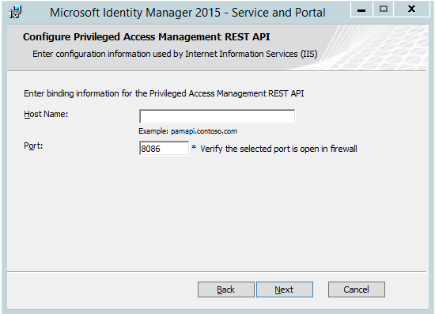
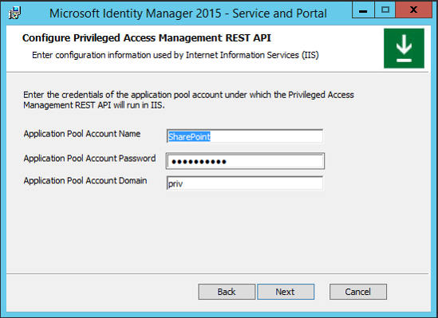
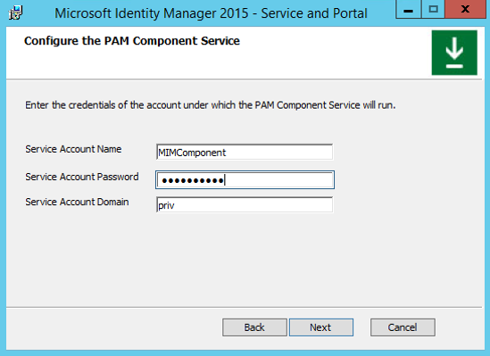
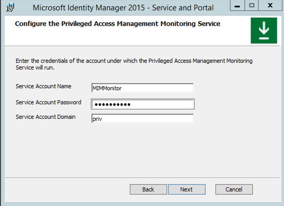

# Schritt 4 – Installieren von MIM-Komponenten auf PAM-Server und Arbeitsstation

1.  Auf *PAMSRV*, melden Sie sich als *PRIV\Administrator* MIM-Dienst und Portal sowie Beispiel-portalwebanwendung installieren können. (Beachten Sie, dass Sie ein Domänenadministrator sein müssen. Wenn Sie die folgenden Befehle nicht als Domänenadministrator ausführen, werden die nachfolgenden Überprüfungen der Vertrauensstellung im nächsten Schritt nicht abgeschlossen.)

2.  Wenn Sie MIM heruntergeladen haben, entpacken Sie das MIM-Installationsarchiv in einem neuen Ordner.

3.  Führen Sie das Installationsprogramm für den Dienst und das Portal aus.  Befolgen Sie die Anweisungen des Installationsprogramms, und schließen Sie die Installation ab.

    1.  Bei der Auswahl der Komponentenfunktionen muss Folgendes einbezogen werden:

        -   MIM-Dienst (einschließlich der privilegierten Zugriffsverwaltung, nicht einschließlich der MIM-Berichterstellung)

        -   MIM-Portal

            

    2.  Geben Sie beim Konfigurieren gemeinsamer Dienste und der MIM-Datenbankverbindung "Create a new database" an.

    3.  Wenn Sie eine e-Mail-Server-Verbindung konfigurieren möchten, legen Sie die e-Mail-Server zu "*corpdc.contoso.local*", und deaktivieren Sie die Option "SSL verwenden" und "e-Mail-Server ist Exchange Server 2007 oder Exchange Server 2010" Kontrollkästchen.

    4.  Geben Sie an, dass ein neues selbstsigniertes Zertifikat generiert wird.

    5.  Geben Sie den Dienstkontonamen als "*MIMService*", und das Kennwort des Dienstkontos als "*Pass@word1*" (das in Schritt 2 angegebene Kennwort), Dienstkontodomäne "PRIV" und das Dienstkonto für die e-Mail-Adresse als "*MIMService@priv.contoso.local*".

    6.  Übernehmen Sie die Standardeinstellungen für den Server-Hostnamen Synchronisierung aus, und geben Sie das MIM-Verwaltungs-Agent-Konto als "*PRIV\mimma*".  Beachten Sie, dass eine Warnmeldung angezeigt wird, dass der MIM-Synchronisierungsdienst nicht vorhanden ist.  Dies ist in Ordnung, da der MIM-Synchronisierungsdienst in diesem TLG-Szenario nicht verwendet wird.

    7.  Geben Sie "*Pamsrv*" als Serveradresse MIM-Dienst.

    8.  Geben Sie "*http://pamsrv.Priv.contoso.Local: 82*" als SharePoint-Website-URL der Auflistung.

    9. Lassen Sie die URL für das Registrierungsportal leer.

    10. Aktivieren Sie das Kontrollkästchen, um die Ports 5725 und 5726 in der Firewall zu öffnen, sowie das Kontrollkästchen, um allen authentifizierten Benutzern den Zugriff auf die MIM-Portalwebsite zu gewähren.

    11. Lassen Sie den PAM REST-API-Hostnamen leer, und geben Sie 8086 Portnummer an (wie im nachfolgenden Screenshot beschrieben):

        

    12. Konfigurieren Sie das Konto MIM PAM REST-API, um das gleiche Konto wie SharePoint zu verwenden (wie das MIM-Portal auf diesem befindet "*SharePoint*", und das Kennwort Pool als "*Pass@word1*" (das in Schritt 2 angegebene Kennwort), und der Pool-Konto-Anwendungsdomäne wie "*PRIV*".

        

        Beachten Sie, dass eine Warnung angezeigt werden kann, dass das Dienstkonto in seiner aktuellen Konfiguration nicht sicher ist.

    13. Konfigurieren Sie den MIM PAM-Komponentendienst. Geben Sie den Kontonamen "*Mimcomponent*", und das Kennwort des Dienstkontos als "*Pass@word1*" (das in Schritt 2 angegebene Kennwort), und die Dienstkontodomäne "*PRIV*".

        

    14. Konfigurieren Sie den PAM-Überwachungsdienst. Geben Sie den Kontonamen "*Mimmonitor*", und das Kennwort des Dienstkontos als "*Pass@word1*" (das in Schritt 2 angegebene Kennwort), und die Dienstkontodomäne "*PRIV*".

        

    15. Lassen Sie auf der Seite zur Eingabe von Informationen für MIM-Kennwortportale die Kontrollkästchen deaktiviert, und fahren Sie fort.  Klicken Sie dann auf **Weiter** um die Installation fortzusetzen.

4.  Nach Abschluss der Installation wird der Server neu gestartet. Überprüfen Sie dann, ob das MIM-Portal aktiv ist, und ermöglichen Sie es Benutzern, ihre eigene Objektressource in MIM anzuzeigen.

    -   Melden Sie sich nach dem Neustart von PAMSRV als „PRIV\Administrator“ an.

    -   Starten Sie Internet Explorer und Verbinden mit dem MIM-Portal auf "*http://pamsrv.Priv.contoso.Local: 82/Identitymanagement*".

        Beachten Sie, dass möglicherweise eine kurze Verzögerung auftritt, wenn die Seite das erste Mal gefunden wird.

    -   Authentifizieren Sie sich in Internet Explorer bei Bedarf als „PRIV\Administrator“.

    -   Öffnen Sie in Internet Explorer die **Internetoptionen**, ändern Sie in der **Registerkarte "Sicherheit"**, und fügen Sie die Website der "*Lokales Intranet*" zone, wenn er nicht bereits vorhanden ist.  Schließen Sie das Dialogfeld „Internetoptionen“.

    -   Klicken Sie in Internet Explorer auf „Verwaltungsrichtlinienregeln“, um das MIM-Portal anzuzeigen.

    -   Suchen Sie nach der verwaltungsrichtlinienregel User Management: *Benutzer können eigene Attribute lesen*.

    -   Wählen Sie diese Management-Richtlinienregel aus, deaktivieren Sie das Kontrollkästchen "**Richtlinie deaktiviert**", klicken Sie auf **OK** und klicken Sie dann auf **Senden**.

5.  Stellen Sie sicher, dass die Firewall eingehende Verbindungen an den TCP-Ports 5725, 5726, 8086 und 8090 zulässt.

    1.  Starten Sie **Windows-Firewall mit erweiterter Sicherheit** (befindet sich in „Verwaltung“).

    2.  Klicken Sie auf **Eingehende Regeln**.

    3.  Stellen Sie sicher, dass die beiden Regeln "*Forefront Identity Manager Service (STS)*"und"*Forefront Identity Manager-Dienst (Webdienst)*" aufgeführt sind.

    4.  Klicken Sie auf **neue Regel**, Option **Port**, auf **TCP**, und geben Sie die lokalen Ports 8086, 8090.   Klicken Sie im Assistenten, um die Standardwerte zu übernehmen, benennen Sie die Regel, und klicken Sie dann auf **Fertig stellen**.

    5.  Nachdem Sie den Assistenten abgeschlossen haben, schließen Sie die Anwendung „Windows-Firewall“.

    6.  Starten Sie die **Systemsteuerung**.

    7.  Klicken Sie auf "**Netzwerkstatus und-Aufgaben anzeigen**", befinden sich unter"**Netzwerk und Internet**".

    8.  Überprüfen Sie, dass ein aktives Netzwerk die angezeigt wird, als "*priv.contoso.local*" als ein "*Domänennetzwerk*".

    9. Schließen Sie die **Systemsteuerung**.

6.  Aus der Beispiel-webanwendungsarchiv (Laden Sie das Archiv von [Identitätsmanagement Beispiele](https://github.com/Azure/identity-management-samples)) entpacken Sie den Inhalt des Ordners identity-management-samples-master\Privileged-Access-Management-Portal\src in einen neuen Ordner Privileged Access Management Portal in den Ordner c:\Programme\Microsoft c:\Programme\Microsoft Forefront Identity Manager\2010.

7.  Installieren und konfigurieren Sie die Beispielwebanwendung für die MIM PAM REST-API.

    1.  Neue Website in IIS erstellen, mit dem Sitenamen "*MIM Privileged Access Management Beispielportal*", physischen Pfad "C:\Programme\Microsoft c:\Programme\Microsoft Forefront Identity Manager\2010\Privileged Access Management Portal" und dem Port 8090.  Dies kann mithilfe der folgenden PowerShell-Befehle erreicht werden:

        ```
        New-WebSite -Name "MIM Privileged Access Management Example Portal" -Port 8090   -PhysicalPath "C:\Program Files\Microsoft Forefront Identity Manager\2010\Privileged Access Management Portal\"
        ```

    2.  Aktivieren Sie die Beispielwebanwendung, damit Benutzer zur MIM PAM REST-API umgeleitet werden können. Mithilfe eines Texteditors wie Notepad, bearbeiten Sie die Datei "*c:\Programme\Microsoft c:\Programme\Microsoft Forefront Identity Manager\2010\Privileged Access Management REST api\web*". In der *& lt;system.webServer & Gt;* enthält, fügen Sie die folgenden Zeilen:

        ```
        <httpProtocol>
                <customHeaders>
        <add name="Access-Control-Allow-Credentials" value="true"  />
        <add name="Access-Control-Allow-Headers" value="content-type" />
        <add name="Access-Control-Allow-Origin" value="http://pamsrv:8090" />  
                </customHeaders>
        </httpProtocol>
        ```

    3.  Konfigurieren Sie die Beispielwebanwendung. Bearbeiten Sie die Datei „C:\Programme\Microsoft Forefront Identity Manager\2010\Privileged Access Management Portal\js\utils.js“ in einem Texteditor wie dem Editor von Windows. In dieser Datei legen Sie für pamRespApiUrl den Wert „http://pamsrv.priv.contoso.local:8086/api/pamresources/“ fest.

    4.  Starten Sie IIS neu, damit diese Änderung wirksam werden.

        ```
        iisreset
        ```

    5.  (Optional) Überprüfen Sie, ob sich der Benutzer für die REST-API authentifizieren kann. Öffnen Sie als Administrator auf *pamsrv*einen Webbrowser.  Navigieren Sie zur Website-URL *http://pamsrv.Priv.contoso.Local: 8086/api/Pamresources/Pamroles/* authentifizieren (falls erforderlich), und stellen Sie sicher, dass ein Download erfolgt.

8.  Installieren Sie die MIM PAM-Requestor-Cmdlets auf der Arbeitsstation.

    1.  Melden Sie sich bei „CORPWKSTN“ als Administrator an.

    2.  Herunterladen der **-Add-ins und Erweiterungen** auf den Computer CORPWKSTN, sofern noch nicht vorhanden.

    3.  Entpacken Sie den Ordner „Add-Ins und Erweiterungen“ aus dem Archiv in einen neuen Ordner.

    4.  Führen Sie das Installationsprogramm **setup.exe**.

    5.  Geben Sie für das benutzerdefinierte Setup an, dass der PAM-Client installiert werden soll. Das MIM-Add-In für Outlook oder die MIM-Kennwort- und -Authentifizierungserweiterungen sollen jedoch nicht installiert werden.

    6.  Geben Sie auf der Adresse PAM-Server als den Hostnamen des PRIV-MIM-Servers *pamsrv.priv.contoso.local*.

9. Nach Abschluss der Installation starten Sie „CORPWKSTN“ neu, um die Registrierung des neuen PowerShell-Moduls abzuschließen.
<!--HONumber=Mar16_HO1-->
