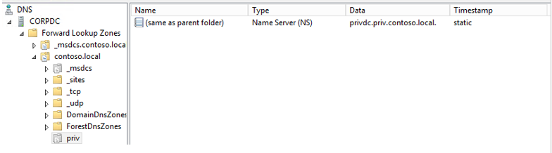

# Schritt 5 – Einrichten einer Vertrauensstellung zwischen den Gesamtstrukturen PRIV und CORP
Die *PRIV* und *CONTOSO* Domänencontroller gebunden sind, durch eine Vertrauensstellung ermöglicht Benutzern in der *PRIV* Domäne Zugriff auf Ressourcen in der CORP-Domäne.

1.  Vor dem Einrichten von Vertrauensstellungen muss jeder Domänencontroller für sein Pendant basierend auf der IP-Adresse des anderen Domänencontrollers/DNS-Servers für die DNS-Namensauflösung konfiguriert werden.

    1.  Stellen Sie sicher, dass keine anderen DNS-Server vorhanden sind, die DNS (Domain Naming Services) für Computer in anderen Domänen bereitstellen.  Wenn die virtuellen Computer über Netzwerkschnittstellen verfügen, die mit öffentlichen Netzwerken verbunden sind, kann es erforderlich sein, die Einstellungen der Windows-Netzwerkschnittstelle außer Kraft zu setzen, um sicherzustellen, dass eine über DHCP bereitgestellte DNS-Serveradresse nicht von beliebigen virtuellen Computern verwendet wird.

    2.  (Optional) Auf *CORPDC*, starten Sie PowerShell, und geben Sie den folgenden Befehl aus.

        ```
        nslookup -qt=ns priv.contoso.local.
        ```
        Stellen Sie sicher, dass die Ausgabe einen Datensatz für den Namenserver für diese Domäne angibt.

    3.  (Optional) Verwenden Sie alternativ **DNS-Manager** (befindet sich in Start, Application-Tools, DNS), bestätigen die Weiterleitung von DNS-Namen für die *PRIV* Domäne *PRIVDC* IP-Adresse.  Mit diesem Programm, und erweitern Sie die Knoten *CORPDC, Forward-Lookupzonen, contoso.local*, und vergewissern Sie sich einen Schlüssel namens *Priv* als Name Server (NS)-Typ vorhanden ist.

        

2.  Auf *PAMSRV*, eine unidirektionale Vertrauensstellung mit *CORPDC* damit der CORP-Domänencontroller vertraut der *PRIV* Gesamtstruktur.

    1.  Stellen Sie sicher, Sie sind angemeldet *PAMSRV* als ein *PRIV* Domänenadministrator (z. B. *PRIV\Administrator*).

    2.  Starten Sie PowerShell.

    3.  Geben Sie die folgenden PowerShell-Befehle aus, und geben Sie die Anmeldeinformationen für den Administrator der CORP-Domäne (z. B. *CONTOSO\Administrator*) bei der entsprechenden Aufforderung bei Bedarf.

        ```
        $ca = get-credential
        New-PAMTrust -SourceForest "contoso.local" -Credentials $ca
        New-PAMDomainConfiguration -SourceDomain "contoso" -Credentials $ca
        ```

3.  Auf *CORPDC*, Lesezugriff auf AD PRIV-Administratoren und den Überwachungsdienst zu aktivieren.

    1.  Stellen Sie sicher, Sie sind angemeldet *CORPDC* als Domänenadministrator an Contoso (z. B. *Contoso\Administrator*).

    2.  Starten Sie **Active Directory-Benutzer und -Computer**.

    3.  Klicken Sie mit der rechten Maustaste auf die Domäne **contoso.local** und wählen Sie **Kontrolle**.

    4.  Klicken Sie auf der ausgewählte Benutzer und Gruppen, die auf **Hinzufügen**.

    5.  Auf der **Auswahl von Benutzern, Computern**, oder **Gruppen** Popup, klicken Sie auf **Speicherorte** und verschieben Sie das Verzeichnis *priv.contoso.local*.  Geben Sie auf den Namen, die *Domänen-Admins* und klicken Sie auf **Namen überprüfen.** Wenn ein Popupfenster angezeigt wird, für den Benutzernamen ein *Priv\administrator* und das Kennwort.

    6.  Nach dem *Domänen-Admins*, Typ "*; MIMMonitor*". Nachdem Sie den Namen "Domänen-Admins" und "mimmonitor" unterstrichen sind, klicken Sie auf **OK**, klicken Sie dann auf **Weiter**.

    7.  Wählen Sie in der Liste der allgemeinen Aufgaben "**liest alle Benutzerinformationen**", klicken Sie dann auf **Weiter** und klicken Sie auf **Fertig stellen**.

    8.  Schließen **Active Directory-Benutzer und Computer**s.

4.  Auf *PAMSRV*, starten Sie die **überwachungs-und Komponentendienste**.

    1.  Stellen Sie sicher, Sie sind angemeldet *PAMSRV* als ein *PRIV* Domänenadministrator (z. B. *PRIV\Administrator*).

    2.  Starten Sie PowerShell.

    3.  Geben Sie die folgenden PowerShell-Befehle ein.

        ```
        net start "PAM Component service"
        net start "PAM Monitoring service"
        ```

5.  (optional) Überprüfen, ob die SID-Verlauf aktiviert und die SID-Filterung deaktiviert ist, für die Vertrauensstellung von der *CORP* Domäne die *PRIV* Domäne.

    1.  Stellen Sie sicher, Sie sind angemeldet *CORPDC* als Domänenadministrator an (z. B. *CONTOSO\Administrator*).

    2.  Öffnen Sie ein PowerShell-Fenster.

    3.  Verwendung **Netdom** sicherstellen, dass der SID-Verlauf aktiviert ist und die SID-Filterung deaktiviert ist.  Geben Sie Folgendes ein:

        ```
        netdom trust contoso.local /quarantine /enablesidhistory:yes /domain priv.contoso.local
        ```
        Die Ausgabe sollte angeben, entweder "**Aktivieren der SID-Verlauf für diese Vertrauensstellung**"oder"**SID-Verlauf für diese Vertrauensstellung bereits aktiviert**".

        Die Ausgabe sollte auch darauf hinweisen, die "**SID-Filter ist nicht für diese Vertrauensstellung aktiviert**". Finden Sie unter [Deaktivieren filterquarantäne](http://technet.microsoft.com/library/cc772816.aspx)  Weitere Informationen.
<!--HONumber=Mar16_HO1-->
