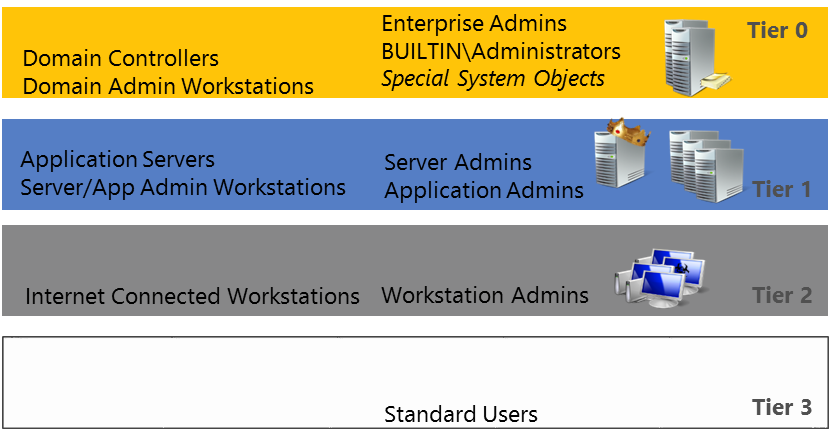

# Ebenenmodell zur Partitionierung von Administratorrechten
## Einführung

Die heutige Bedrohungslage verringert die Effektivität eines Schutzes an den Außenbereichen, auch wenn der Netzwerkrand weiterhin eine wichtige Komponente einer umfassenderen Strategie ist. Der Verlust dieser Außenrandverteidigung erfordert von einer Organisation, dass sie davon ausgehen muss, dass die Verletzung bereits geschehen ist, um entsprechende Schutzmaßnahmen für Berechnungs- und geschäftliche Ressourcen zu entwerfen. Damit Organisationen dies in einem angemessenen Rahmen durchführen können, wird in diesem Dokument ein Sicherheitsmodell beschrieben, das eine Rechteerweiterung verhindert (und damit die empfohlenen Vorgehensweisen und Sicherheitsrichtlinien umsetzt) und trotzdem eine angenehme Benutzererfahrung bietet.

Partitionieren Administratorberechtigungen in Ebenen vereinfacht das Ermitteln der Benutzer und Gruppen eignen sich für die Aufnahme in einen [geschützten Umgebung](planning-bastion-environment.md).

## Hintergrund: Rechteerweiterungen in Active Directory-Gesamtstrukturen

Benutzer, Dienste oder Anwendungskonten, die dauerhaft volle Administratorrechte für Windows Server-Active Directory-Gesamtstrukturen haben, stellen ein großes Risiko für die Arbeit und die Geschäfte von Organisationen dar. Diese Konten sind häufig das Ziel von Angreifern, da sie bei einer Gefährdung i. d. R. sofort die Berechtigung für das Herstellen einer Verbindung mit beliebigen anderen Servern oder Anwendungen in der Domäne bieten.

Bei einigen Bereitstellungen wurden Domänen so konfiguriert, dass Konten- und Serverbetreiber über die Konten, Server und Anwendungen vollständige Administratorrechte erhalten und diese Rollen effektiv steuern können. In den meisten Fällen sollen diese Konfigurationen die Notwendigkeit der Ausführung von Anwendungen mit Administratorrechten für entweder alle Clients oder Server in der Domäne oder für alle Benutzer- oder Computerkonten in der Domäne unterstützen. Nur wenige Anwendungen benötigen jedoch beide dieser Arten von Berechtigungen. Deshalb stellt das Erteilen von Verzeichnisadministratorrechten für beides eine Überberechtigung dar, von der Angreifer oder böswillige interne Mitarbeiter profitieren.

## Ebenenmodell zur Verringerung von Rechteerweiterungen

Die folgende Anleitung bietet ein einfaches Modell für die schnelle Einteilung vorhandener Ressourcen und die Einrichtung von Zonen zum Einschränken der Kontonutzung. Dieses Modell orientiert sich an den hierarchischen Biba- und Bell-LaPadula-Modellen für die administrative Kontrolle. Es ist gekennzeichnet durch drei Ebenen von Administratorrechten (plus einer Ebene für Endbenutzer, die domänenweite Administratoren sind). Für eine bessere Partitionierung und Verwaltung von Administratorzugriffsrechten werden die Konten und Anwendung in eine der vier Berechtigungsebenen eingeteilt. Dies erfolgt in Abhängigkeit von ihrem Einfluss auf den Betrieb der Organisation:

- **Ebene 0:** Gesamtstrukturadministratoren – direkte oder indirekte administrative Kontrolle über die Active Directory-Gesamtstruktur, die Domänen oder die Domänencontroller

- **Ebene 1:** Serveradministratoren – direkte oder indirekte administrative Kontrolle über einzelne oder mehrere Server

- **Ebene 2:** Arbeitsstationsadministratoren – direkte oder indirekte administrative Kontrolle über mehrere Geräte

- **Ebene 3:** Benutzer – nicht berechtigte Benutzer oder die administrative Kontrolle über ein einziges Gerät

Entsprechend den geschäftlichen Anforderungen müssen möglicherweise noch weitere Ebenen oder eine zusätzliche Segmentierung eingefügt werden, dieses Modell kann aber als Ausgangspunkt verwendet werden.

### Richtlinien für ein Rechtemodell mit mehreren Ebenen

Das Modell soll eine Erhöhung der Berechtigungen durch einen Angreifer verhindern, der gestohlene Anmeldeinformationen verwendet. Dafür gelten die folgenden Regeln:

1. Alle verwalteten Ressourcen (Gruppen, Konten, Server, Arbeitsstationen, Active Directory-Objekte oder Anwendungen) werden genau einer Ebene zugeordnet, um eine Erhöhung der Rechte durch einen Angreifer zu verhindern, der Techniken zum Diebstahl von Anmeldeinformationen einsetzt.

2. Mitarbeiter mit Verantwortung für die Anmeldung und Verwaltung von Ressourcen auf mehreren Ebenen erhalten separate Administratorkonten für jede benötigte Ebene. Jedes Konto, das sich derzeit noch bei mehreren Kategorien anmelden kann, wird in mehrere Konten aufgeteilt, die jeweils einer Ebenendefinition entsprechen. Diese Konten benötigen auch unterschiedliche Kennwörter.

3. Administratorkonten können dann über einen solchen administrativen Zugriff keine Ressourcen auf höheren Ebenen wie Zugriffssteuerungslisten (ACLs), Anwendungs-Agents oder Dienstkonten steuern. Konten für eine höhere Ebene können sich nicht bei Computern auf niedrigerer Ebene anmelden, da eine solche Anmeldung möglicherweise die Anmeldeinformationen und Berechtigungen, die diesem Konto zugewiesen sind, versehentlich verfügbar machen oder die Kontrolle darüber gewähren kann. Unter bestimmten Ausnahmen können Remotedesktopverbindungen mit RDP im eingeschränkten Administratormodus verwendet werden, ohne die Anmeldeinformationen offenzulegen.

4. Administrative Konten können gemäß ihrer Rolle Ressourcen auf niedrigerer Ebene steuern. Dies erfolgt jedoch ausschließlich über die Verwaltungsschnittstellen auf der höheren Ebene, die keine Anmeldeinformationen offenlegen. Ein Beispiel hierfür sind Domänenadministratorkonten (Ebene 0), die Active Directory-Kontoobjekte des Serveradministrators (Ebene 1) über Active Directory-Verwaltungskonsolen auf einem Domänencontroller (Ebene 0) verwalten.

5. Jede Organisationseinheit (OE), die Computerkonten enthält, darf nur Computerkonten der eigenen Ebene enthalten. Wenn eine Organisationseinheit Computerkonten für mehrere Ebenen enthält, werden die Computerkonten für eine Ebene in eine andere Domäne oder Organisationseinheit verschoben, oder es werden separate untergeordnete Organisationseinheiten für die einzelnen Ebenen erstellt.

### Ebene 0 – Domänen-/Gesamtstrukturadministrator

Jede Person mit Kontrolle über die Gruppen, Konten, Domänencontroller, speziellen Active Directory-Objekte und Anwendungen dieser Ebene kann beliebigen Code an jeder Stelle in der Domäne oder der Gesamtstruktur ausführen. Der Gültigkeitsbereich der Ebene 0 ist relativ zu einer einzigen Active Directory-Domäne. Einige Konten oder andere Elemente können jedoch in mehreren Domänen Auswirkungen auf Ebene 0 haben. Ebene 0 enthält:

#### Server und Arbeitsstationen

- Domänencontroller
- Server, auf denen eine Verwaltungsanwendung gehostet wird, die einen Agent auf einem Domänencontroller steuert
- Server oder Arbeitsstationen, auf denen sich Ebene-0-Konten anmelden, einschließlich Servern oder Arbeitsstationen, auf denen Ebene-0-Anmeldeinformationen verfügbar gemacht werden (z. B. Server/Arbeitsstationen, auf denen ein Dienst mit denselben Anmeldeinformationen wie für die Ausführung eines Diensts auf einem Ebene-0-Server oder für andere Verwaltungsaufgaben auf dem Ebene-0-Server verwendet werden)

#### Active Directory-Objekte

- Das AdminSDHolder-Objekt im Systemcontainer jeder Domäne
- Der Systemcontainer im Domänennamenskontext
- Die Organisationseinheit des Domänencontrollers
- Jede Organisationseinheit, die Objekte der Ebene 0 enthält (einschließlich der übergeordneten Organisationseinheiten)
- Jedes Gruppenrichtlinienobjekt, das mit einer Organisationseinheit der Ebene 0 verknüpft ist

#### Active Directory-Gruppen
- Integrierte und vordefinierte AD-Gruppen und Mitglieder dieser Gruppen, einschließlich:
  - Domänen-Admins
  - Organisations-Admins
  - Schema-Admins
  - Vordefiniert\\Administratoren
  - Konten-Operatoren
  - Sicherungsoperatoren

- Gruppen, denen Berechtigungen äquivalent zu einer Ebene-0-Gruppe (oben aufgeführt) delegiert wurden, einschließlich:
  - Der Möglichkeit, (fast) alle Objekte in Active Directory zu ändern
  - Die Möglichkeit, die Kennwörter beliebiger Ebene-0-Konten zurückzusetzen
  - Gruppen, denen die Berechtigung zum Ändern anderer Ebene-0-Objekte (Benutzer, Gruppen, Computer, Organisationseinheiten, Gruppenrichtlinien oder spezielle Objekte) oder der Vollzugriff darauf gewährt wurde

#### Konten
- Das integrierte Administratorkonto
- Konten, die Mitglied einer beliebigen Ebene-0-Gruppe sind
- Konten mit Schreib- oder Vollzugriff auf beliebige Ebene-0-Objekte
- Konten, denen Berechtigungen äquivalent zu einer Ebene-0-Gruppe (einschließlich der oben für Ebene-0-Gruppen aufgeführten) delegiert wurden
- Konten mit Administratorrechten für Anwendungen auf Ebene 0

#### Anwendungen
- Anwendungen, die als Dienst auf Domänencontrollern ausgeführt werden
- Anwendungen, die einen Agent auf Domänencontrollern steuern

#### Hardware und Geräte
- Hardware, auf der Ebene-0-Systeme ausgeführt werden (dies hängt möglicherweise davon ab, ob abgeschirmte VMs für Domänencontroller bereitgestellt werden)
- Jede Person mit Zugriff auf physische Hardware von Domänencontrollern oder ähnlichen Systemen und Sicherungen
- Jede Person mit Administratorzugriff auf Hosts für virtuelle Computer, auf denen virtualisierte Ebene-0-Computer gehostet werden
- Geräte, auf denen Anmeldeinformationen für die Ebene 0 eingegeben oder gespeichert werden (z. B. mobile Geräte, die für den Remotezugriff verwendet werden)

### Ebene 1 – Server- und Anwendungsadministratoren

Jede Person mit Kontrolle über Server, die keine Domänencontroller sind, und die zugehörigen administrativen Gruppen und Konten in der Active Directory-Domäne für die Produktionsumgebung hat die Möglichkeit, beliebigen Code auf diesen Servern auszuführen. Der Gültigkeitsbereich der Ebene 1 ist relativ zu einer einzelnen Active Directory-Domäne. Ebene-1-Ressourcen umfassen alle Ressourcen, die die folgenden Kriterien erfüllen (und nicht als Ebene 0 klassifiziert sind):

#### Server und Arbeitsstationen
- Server, die der Domäne beigetreten sind
- Arbeitsstationen, auf denen sich Ebene-1-Konten anmelden, einschließlich Arbeitsstationen, auf denen Ebene-1-Anmeldeinformationen verfügbar gemacht werden (z. B. Arbeitsstationen, auf denen ein Dienst mit denselben Anmeldeinformationen wie für die Ausführung eines Diensts auf einem Ebene-1-Server oder für andere Verwaltungsaufgaben auf dem Ebene-1-Server verwendet werden)

#### Active Directory-Objekte
- Eine beliebige Organisationseinheit, die Objekte der Ebene 1 enthält
- Jedes Gruppenrichtlinienobjekt, das mit einer Organisationseinheit der Ebene 1 verknüpft ist

#### Active Directory-Gruppen
- Die Gruppe „Serveroperatoren“ (oder eine Gruppe, die Mitglied dieser Gruppe ist)
- Gruppen, deren Mitgliedern Schreib- oder Vollzugriff auf Ebene-1-Objekte gewährt wurde, bzw. Gruppen, denen Bearbeitungs- oder Vollzugriff auf Ebene-1-Objekte (Benutzer, Gruppen, Computer, Organisationseinheiten oder Gruppenrichtlinienobjekte) gewährt wurde

#### Konten
- Konten, die Mitglied einer beliebigen Ebene-1-Gruppe sind
- Konten mit Schreib- oder Vollzugriff auf ein anderes Ebene-1-Objekt (häufig Helpdeskkonten), einschließlich Konten, denen Berechtigungen äquivalent zu einer Ebene-1-Gruppe (einschließlich der oben für Ebene-1-Gruppen aufgeführten) delegiert wurden
- Konten, die Mitglied der lokalen Administratorgruppe auf einem oder mehreren Servern sind
- Konten mit Administratorrechten für Anwendungen auf Ebene 1

#### Anwendungen
- Anwendungen, die als Dienst auf Ebene-1-Servern ausgeführt werden
- Anwendungen, die einen Agent auf Ebene-1-Servern steuern

#### Hardware und Geräte
- Hardware, auf der Ebene-1-Systeme ausgeführt werden
- Jede Person mit Zugriff auf physische Hardware für Server
- Jede Person mit Administratorzugriff auf Hosts für virtuelle Computer, auf denen virtualisierte Ebene-1-Computer gehostet werden
- Geräte, auf denen Anmeldeinformationen für die Ebene 1 eingegeben oder gespeichert werden (z. B. mobile Geräte, die für den Remotezugriff verwendet werden)

### Ebene 2 – Arbeitsstations- und Endbenutzeradministratoren

Jede Person mit Kontrolle über die Arbeitsstationen und die Standardbenutzer in der Active Directory-Domäne für die Produktionsumgebung hat die Möglichkeit, beliebigen Code auf diesen Arbeitsstationen bzw. als diese Benutzer auszuführen. Der Gültigkeitsbereich der Ebene 2 ist relativ zu einer einzelnen Active Directory-Domäne. Ebene-2-Ressourcen umfassen alle Ressourcen, die die folgenden Kriterien erfüllen (und nicht als Ebene 0 oder Ebene 1 klassifiziert sind):

#### Arbeitsstationen
- Arbeitsstationen in der Umgebung, in der sich alle Benutzer anmelden können (mit Ausnahme von administrativen Arbeitsstationen, die von Ebene-1- oder Ebene-0-Konten verwendet werden)

#### Active Directory-Objekte
 - Beliebige Organisationseinheiten mit Objekten der Ebene 2
 - Jedes Gruppenrichtlinienobjekt, das mit einer Organisationseinheit der Ebene 2 verknüpft ist

#### Active Directory-Gruppen
- Gruppen, denen die Berechtigung zum Ändern anderer Ebene-2- oder Ebene-3-Objekte (Benutzer, Gruppen, Computer, Organisationseinheiten oder Gruppenrichtlinienobjekte) oder der Vollzugriff darauf gewährt wurde
- Gruppen, die Mitglied der lokalen Administratorgruppe auf einer oder mehreren Arbeitsstationen sind (z. B. Helpdeskadministratoren und andere Supportgruppen für PC- und Endbenutzer)

#### Konten
- Konten, die Mitglied einer beliebigen Ebene-2-Gruppe sind
- Konten, die Mitglied der lokalen Administratorgruppe auf einer oder mehreren Arbeitsstationen sind

> [! Hinweis] {Dies kann alle Endbenutzer einschließen, wenn sie über Administratorrechte auf ihren Arbeitsstationen gewährt werden.}

- Konten mit Schreib- oder Vollzugriff auf beliebige andere Ebene-2-Objekte
- Konten mit Administratorrechten für Anwendungen auf Ebene 2

#### Anwendungen
- Anwendungen, die als Dienst auf Arbeitsstationen ausgeführt werden
- Anwendungen, die einen Agent auf Arbeitsstationen steuern

#### Hardware und Geräte
- Hardware, auf der Ebene-2-Systeme ausgeführt werden
- Jede Person mit Zugriff auf physische Hardware für Arbeitsstationen
- Jede Person mit Administratorzugriff auf Hosts für virtuelle Computer, auf denen virtualisierte Ebene-2-Computer gehostet werden
- Geräte, auf denen Anmeldeinformationen für die Ebene 2 eingegeben oder gespeichert werden (z. B. mobile Geräte, die für den Remotezugriff verwendet werden)

### Ebene 3 – Standardbenutzer

Diese Ebene umfasst Standardbenutzer ohne Administratorrechte für mehrere Computer in der Domäne.

## Einschränken der Offenlegung von Anmeldeinformationen mit Anmeldeeinschränkungen

Das Risiko des Diebstahls von Anmeldeinformationen für Administratorkonten erfordert in der Regel ein Umformen der administrativen Verfahren, um die Anfälligkeit für Angriffe zu verringern. Als erste Schritte sollten Organisationen Folgendes erledigen:

- Die Anzahl der Hosts, auf denen Administratoranmeldeinformationen verfügbar gemacht werden, verringern.
- Die Rollenberechtigungen auf die Mindestanforderungen beschränken.
- Sicherstellen, dass administrative Aufgaben nicht auf Hosts ausgeführt werden, die für Standardbenutzeraktivitäten (z. B. E-Mail und Browsen im Internet) verwendet werden.

Im nächsten Schritt müssen Anmeldebeschränkungen implementiert und Prozesse und Vorgehensweisen umgesetzt werden, die die Einhaltung der Anforderungen an das Ebenenmodell sicherstellen. Im Idealfall sollte die Offenlegung von Anmeldeinformationen auf die niedrigste Berechtigung für die Rolle auf der jeweiligen Ebene reduziert werden:

Anmeldebeschränkungen sollten Folgendes sicherstellen:

- Domänenadministratoren (Ebene 0) können sich nicht bei Unternehmensservern (Ebene 1) und Standardbenutzer-Arbeitsstationen (Ebene 2) anmelden.
- Serveradministratoren (Ebene 1) können sich nicht bei Standardbenutzer-Arbeitsstationen (Ebene 2) anmelden.

>[Hinweis] {Serveradministratoren sollten nicht Mitglied der Domänenadministratorgruppe sein. Personen mit Verantwortung für die Verwaltung von Domänencontrollern und Unternehmensservern benötigen separate Konten.}

Anmeldebeschränkungen können durch Folgendes erzwungen werden:

- Beschränkung von Anmelderechten über Gruppenrichtlinien, einschließlich: Zugriff vom Netzwerk auf diesen Computer verweigern, Batchanmeldung verweigern, Dienstanmeldung verweigern, lokale Anmeldung verweigern, Anmeldung über Remotedesktopeinstellungen verweigern
- Authentifizierungsrichtlinien und Silos bei Verwendung von Windows Server 2012 oder höher
- Ausgewählte Authentifizierung, wenn das Konto Mitglied einer dedizierten administrativen Gesamtstruktur ist

Das nächste Dokument [Planen einer geschützten Umgebung](planning-bastion-environment.md), beschreibt das Hinzufügen eine dedizierte administrative Gesamtstruktur für Microsoft Identity Manager, der administrative Konten einzurichten.
<!--HONumber=Mar16_HO1-->
