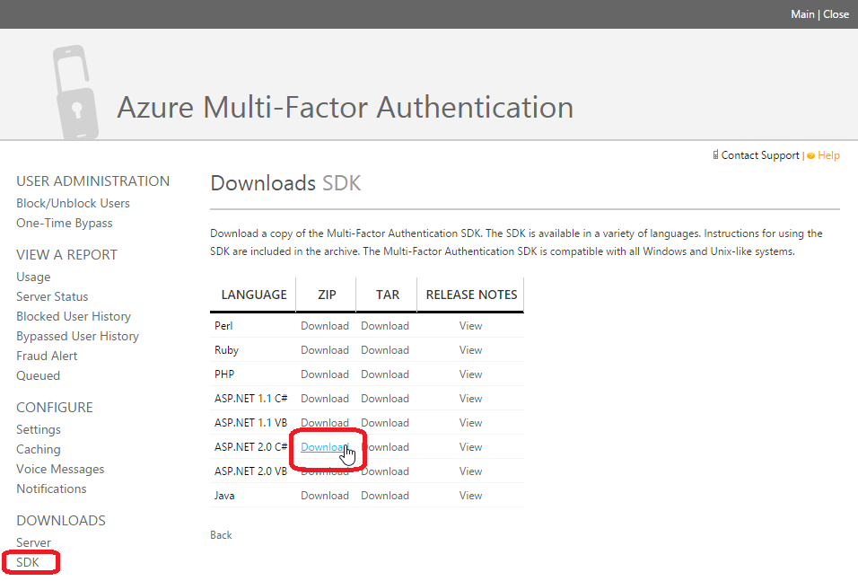

# Verwenden von Azure MFA zur Aktivierung
Beim Konfigurieren einer PAM-Rolle können Sie die Autorisierungsanforderungen festlegen, die ein Kandidatenbenutzer erfüllen muss, um die Rolle zu aktivieren. Die PAM-Autorisierungsaktivität implementiert diese Wahlmöglichkeiten:

- Rolle Besitzergenehmigung
- Azure MFA

Wenn keine Option aktiviert ist, werden Kandidatenbenutzer automatisch für ihre Rolle aktiviert.

Microsoft Azure Multi-Factor Authentication (MFA) ist ein Authentifizierungsdienst, der von Benutzern verlangt, ihre Anmeldeversuche über eine mobile App, einen Telefonanruf oder eine Textnachricht zu verifizieren. Der Dienst kann mit Microsoft Azure Active Directory sowie als Dienst für Cloud- und lokale Unternehmensanwendungen verwendet werden. Für das PAM-Szenario stellt Azure MFA einen zusätzlichen Authentifizierungsmechanismus bereit, der bei der Autorisierung verwendet werden kann, unabhängig davon, wie sich ein Kandidatenbenutzer zuvor bei der Windows PRIV-Domäne authentifiziert hat.

## Voraussetzungen

Um Azure MFA mit MIM zu verwenden, benötigen Sie Folgendes:

- Internetzugriff von jedem MIM-Dienst aus, der PAM bereitstellt, um die Verbindung zum Azure MFA-Dienst herzustellen
- Ein Azure-Abonnement
- Azure Active Directory Premium-Lizenzen für Kandidatenbenutzer oder ein alternatives Verfahren zum Lizenzieren von Azure MFA
- Telefonnummern für alle Kandidatenbenutzer

## Erstellen eines Azure MFA-Anbieters

In diesem Abschnitt richten Sie Ihren Azure MFA-Anbieter in Microsoft Azure Active Directory ein.  Wenn Sie Azure MFA bereits verwenden, sei es eigenständig oder in Verbindung mit Azure Active Directory Premium konfiguriert, fahren Sie mit dem nächsten Abschnitt fort.

1.  Öffnen Sie einen Webbrowser, und verbinden Sie sich mit dem Azure-Verwaltungsportal unter [https://manage.windowsazure.com](https://manage.windowsazure.com) , und zwar als der Benutzer mit die Azure-Abonnementadministratorrolle.

2.  Klicken Sie in der unteren linken Ecke auf **Neu**.

3.  Klicken Sie auf **Anwendungsdienste \ > Active Directory \ > Multi-Factor Authentication-Anbieter \ > Schnellerfassung**.

4.  Geben Sie im Feld **Name** den Wert **PAM**ein, und wählen Sie im Feld „Nutzungsmodell“ den Wert „Pro aktiviertem Benutzer“ aus. Wenn Sie bereits über ein Azure AD-Verzeichnis verfügen, wählen Sie es aus. Klicken Sie abschließend auf **Erstellen**.

## Herunterladen der Azure MFA-Dienstanmeldeinformationen

Im nächsten Schritt generieren Sie eine Datei, die die von der MFA zum Kontaktieren von Azure MFA benötigten Authentifizierungsdaten enthält.

1. Öffnen Sie einen Webbrowser, und verbinden Sie sich mit dem Azure-Verwaltungsportal unter [https://manage.windowsazure.com](https://manage.windowsazure.com) als Azure-Abonnementadministrator.

2.  Klicken Sie im Azure-Portalmenü auf **Active Directory** , und klicken Sie dann auf die Registerkarte **Anbieter für mehrstufige Authentifizierung** .

3.  Klicken Sie auf den Azure MFA-Anbieter, den Sie für PAM verwenden möchten, und klicken Sie dann auf **Verwalten**.

4.  Klicken Sie im neuen Fenster im linken Bereich unter **Konfigurieren**auf **Einstellungen**.

5.  Klicken Sie im Fenster **Azure Multi-Factor Authentication** unter **Downloads** auf **SDK**.

6.  Klicken Sie in der Spalte „ZIP“ auf den Link **Herunterladen** für die Datei mit der Sprache **SDK for ASP.net 2.0 C\#**.



7.  Kopieren Sie die resultierende ZIP-Datei auf alle Systeme, auf denen der MIM-Dienst installiert ist. 

--------------------------------------------------

HINWEIS: Bedenken Sie dabei, dass die ZIP-Datei Schlüsselmaterial enthält, das zur Authentifizierung beim Azure MFA-Dienst verwendet wird.

--------------------------------------------------

## Konfigurieren des MIM-Diensts für Azure MFA

1.  Melden Sie sich am Computer, auf dem der MIM-Dienst installiert ist, als Administrator oder als der Benutzer an, der MIM installiert hat.

2.  Erstellen Sie einen neuen Verzeichnisordner unter dem Verzeichnis, in dem der MIM-Dienst installiert wurde, z. B. *C:\\Programme\\Microsoft Forefront Identity Manager\\2010\\Service\\MfaCerts*.

3.  Navigieren Sie in Windows Explorer zum Ordner „Pf\\certs“ der ZIP-Datei, die Sie im vorherigen Abschnitt heruntergeladen haben, und kopieren Sie die Datei *cert\_key.p12* in das neue Verzeichnis.

4.  Navigieren Sie im Windows Explorer in den Ordner „pf“ der ZIP-Datei, und öffnen Sie die Datei *pf\_auth.cs* in einem Text-Editor. Wenn auf dem System kein Text-Editor installiert ist, verwenden Sie Wordpad zum Anzeigen der Datei.

5.  Suchen Sie diese drei Parameter: „LICENSE\KEY“, „GROUP\KEY“, „CERT\_PASSWORD“.


6.  Öffnen Sie im Editor *MfaSettings.xml* , die Sie unter dem Pfad *C:\\Programme\\Microsoft Forefront Identity Manager\\2010\\Service*finden.

7.  Kopieren Sie die Werte aus den Parametern „LICENSE\KEY“, „GROUP\KEY“, „CERT\PASSWORD“ in der Datei *pf\auth.cs* in die entsprechenden XML-Elemente in der Datei *MfaSettings.xml* .

8.  In der & Lt; CertFilePath & Gt; XML-Element, geben Sie den vollständigen Pfadnamen der der *cert\_key.p12* -Datei zuvor extrahiert.

9.  Geben Sie im Element &lt;username&gt; einen beliebigen Benutzernamen ein.

10.  Geben Sie im Element &lt;DefaultCountryCode&gt; die Landesvorwahl für Anrufe bei Ihren Benutzern an, z. B. „1“ für die USA und Kanada. Dieser Wert wird für den Fall verwendet, dass Benutzer mit Telefonnummern registriert werden, die keine Landesvorwahl enthalten. Wenn die Telefonnummer eines Benutzers eine internationale Landesvorwahl aufweist, die sich von der für die Organisation konfigurierten unterscheidet, muss die betreffende Landesvorwahl in der registrierten Telefonnummer enthalten sein.

11.  Speichern und überschreiben Sie die Datei *MfaSettings.xml* im MIM-Dienstordner *C:\\Programme\\Microsoft Forefront Identity Manager\\2010\\Service.* 

--------------------------------------------------

HINWEIS: Stellen Sie am Ende des Vorgangs sicher, dass die Datei *MfaSettings.xml*oder alle Kopien von ihr oder der ZIP-Datei keine öffentlichen Leserechte aufweisen.

--------------------------------------------------


## Aktivieren eines PAM-Benutzers für Azure MFA

Damit ein Benutzer eine Rolle aktivieren kann, für die Azure MFA erforderlich ist, muss die Telefonnummer des Benutzers in MIM gespeichert sein. Die Festlegung dieses Attributs erfolgt auf zwei Arten.

Beim ersten Verfahren kopiert der Befehl „New-PAMUser“ ein Telefonnummerattribut aus dem Verzeichniseintrag des Benutzers in der CORP-Domäne in die MIM-Dienstdatenbank. Beachten Sie, dass es sich dabei um einen einmaligen Vorgang handelt.

Beim zweiten Verfahren aktualisiert der Befehl „Set-PAMUser“ das Telefonnummerattribut in der MIM-Dienstdatenbank. Beispielsweise ersetzt der folgende Befehl die Telefonnummer eines vorhandenen PAM-Benutzers im MIM-Dienst. Der Verzeichniseintrag bleibt unverändert.

```
Set-PAMUser (Get-PAMUser -SourceDisplayName Jen) -SourcePhoneNumber 12135551212
```


## Aktivieren einer PAM-Rolle für Azure MFA

Sobald die Telefonnummern aller Kandidatenbenutzer in der MIM-Dienstdatenbank gespeichert ist, kann die Rolle für Azure MFA aktiviert werden. Dies erfolgt mithilfe des Befehls „New-PAMRole“ oder „Set-PAMRole“. Beispiel:

```
Set-PAMRole (Get-PAMRole -DisplayName "R") -MFAEnabled 1
```


Azure MFA kann für eine Rolle durch Festlegen des Parameters „-MFAEnabled 0“ des Befehls „Set-PAMRole“ deaktiviert werden.

## Problembehandlung

Die folgenden Ereignisse finden sich im Privileged Access Management-Ereignisprotokoll:

| ID  | Schweregrad    | Generiert von           | Beschreibung                                                      |
|-----|-------------|------------------------|------------------------------------------------------------------|
| 101 | Fehler       | MIM-Dienst            | Der Benutzer hat die Azure MFA nicht abgeschlossen (z. B. weil er nicht ans Telefon gegangen ist). |
| 103 | Informationen | MIM-Dienst            | Der Benutzer hat Azure MFA während der Aktivierung abgeschlossen.                       |
| 825 | Warning     | PAM-Überwachungsdienst | Die Telefonnummer wurde geändert.                                |

Wenn Sie weitere Informationen zu Fehlern bei Telefonanrufen (Ereignis 101) benötigen, können Sie auch einen Bericht von Azure MFA anzeigen oder herunterladen.

1.  Öffnen Sie einen Webbrowser und Herstellen einer Verbindung mit der [Azure-Verwaltungsportal](https://manage.windowsazure.com) als globaler Azure AD-Administrator.

2.  Klicken Sie im Azure-Portalmenü auf **Active Directory** , und klicken Sie dann auf die Registerkarte **Anbieter für mehrstufige Authentifizierung** .

3.  Klicken Sie auf den Azure MFA-Anbieter, den Sie für PAM verwenden, und klicken Sie dann auf **Verwalten**.

4.  Klicken Sie im neuen Fenster auf **Verwendung**und dann auf **Benutzerdetails**.

5.  Wählen Sie den Zeitraum aus, und aktivieren Sie das Kontrollkästchen neben dem **Namen** in der Spalte für weitere Berichte. Klicken Sie auf **Als CSV exportieren**.

6.  Wenn der Bericht generiert wurde, können Sie ihn im Portal anzeigen oder, wenn der MFA-Bericht umfangreich ist, ihn als CSV-Datei herunterladen. Der Wert**SDK**in der Spalte **AUTH TYPE** zeigt Zeilen an, die als PAM-Aktivierungsanforderungen relevant sind: Dies sind Ereignisse, die von MIM oder anderer lokal ausgeführter Software stammen. Das Feld **USERNAME** stellt die GUID des Benutzerobjekts in der MIM-Dienstdatenbank dar. Wenn ein Aufruf nicht erfolgreich war, steht in der Spalte **AUTHD** der Wert**No**, und der Wert der Spalte **CALL RESULT** enthält die Details der Fehlerursache.
<!--HONumber=Mar16_HO1-->
